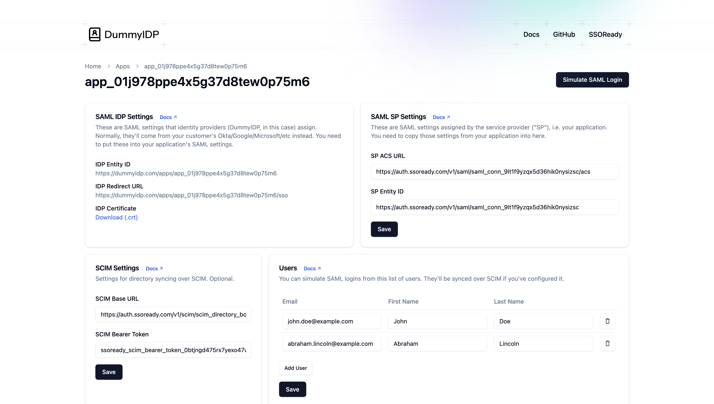
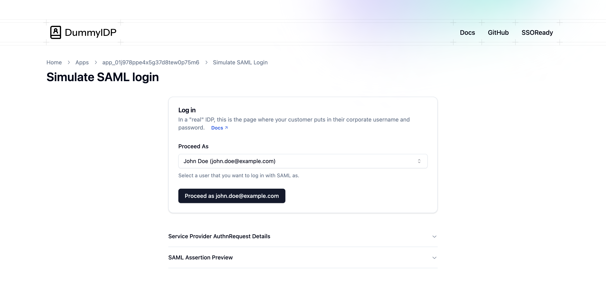

[SSOReady](https://ssoready.com) is an open-source dev tool for adding
[SAML](/docs/saml/saml-quickstart) and [SCIM](/docs/scim/scim-quickstart)
support to your product. [DummyIDP](https://dummyidp.com) by SSOReady is a free,
[open-source](https://github.com/ssoready/dummyidp) website to test your SAML
and/or SCIM integration end-to-end.

SAML and SCIM are two-sided protocols: you use SSOReady to implement your side
of the protocol, and your customer uses an identity provider ("IDP") vendor to
implement their side of the protocol. The problem is that IDPs are complicated
(and usually expensive) to set up. DummyIDP is a simplified IDP that implements
the SAML and SCIM protocol just like commercial IDPs do, while also being super
easy for you to set up.

With DummyIDP, you can test your SAML and SCIM integration end-to-end from your
customer's perspective. Instead of signing up for a commercial IDP, you can just
use DummyIDP to simulate your customer's setup in a few minutes.

# Creating a DummyIDP App

DummyIDP simulates a lightweight subset of identity providers' functionality.
This helps you avoid navigating complicated identity provider software like
Microsoft Entra just to test your SSOReady implementation. Specifically, a
DummyIDP app allows you to manage a list of users, log in as those users via
SAML, and optionally sync that list of users via SCIM.

To create a DummyIDP application, go to https://dummyidp.com and click on "Get
started". That creates a new DummyIDP application, and you'll see something like
this:

<Frame caption="A screenshot of a DummyIDP app">
    
</Frame>

## IDP Settings

DummyIDP simulates your customer's identity provider. As a result, DummyIDP
provides SAML settings that normally you'd get from your customer:

* An [IDP Entity ID](/docs/ssoready-concepts/saml-connections#idp-entity-id)
* An [IDP Redirect URL](/docs/ssoready-concepts/saml-connections#redirect-url)
* An [IDP Certificate](docs/ssoready-concepts/saml-connections#certificate) that
you can download

Every DummyIDP app also has an IDP Metadata URL, which is a standardized way
to distill all three data points above into a single file.

These are settings that you need to input into your SSOReady [SAML
Connection](/docs/ssoready-concepts/saml-connections). You can either input the
IDP Metadata URL, or each of the three settings individually.

## SP Settings

When you implement SAML, your application acts as the SAML "Service Provider"
("SP"). SP settings are settings your application assigns, and which your
customer needs to input into their identity provider.

When you use SSOReady, your SSOReady SAML connection assigns these SP settings
for you. When you use DummyIDP, you need to copy these SP settings from your
SSOReady SAML connection into DummyIDP:

* An [ACS URL](/docs/ssoready-concepts/saml-connections#assertion-consumer-service-acs-url)
* An [SP Entity ID](/docs/ssoready-concepts/saml-connections#sp-entity-id)

## Simulating SAML Logins

You are ready to simulate SAML logins using DummyIDP once you have:

1. [Created a DummyIDP application](#creating-a-dummyidp-app),
2. [Copied the DummyIDP-assigned IDP settings into SSOReady](#idp-settings) (or your own system, if you aren't using SSOReady)
3. [Copied the SSOReady-assigned SP settings into DummyIDP](#sp-settings) (or, again, your own system if it's not SSOReady)

To simulate a login, the easiest option is to click on "Simulate SAML Login".

<Frame caption="A screenshot of the DummyIDP Simulate SAML Login page">
    
</Frame>

From this SAML login simulation page, you can tell DummyIDP which user you would
like DummyIDP to log you in, over SAML, as. The list of users on offer is
determined by the DummyIDP app's [users settings](#users-settings), which you
can customize.

## SCIM Settings

The [IDP settings](#idp-settings) and [SP settings](#sp-settings) above are
related to configuring SAML. You can also use DummyIDP to test your
application's SCIM support.

To use SCIM with DummyIDP, you need to copy two SCIM settings from your
application into DummyIDP. If you use SSOReady, these settings are assigned for
you and live on a [SCIM Directory](/docs/ssoready-concepts/scim-directories):

* A [SCIM Base URL](/docs/ssoready-concepts/scim-directories#scim-base-url)
* A [SCIM Bearer Token](/docs/ssoready-concepts/scim-directories#scim-authentication)

Once you've saved these settings, DummyIDP will immediately send SCIM HTTP
requests to sync over all of the [users](#users-settings) you've configured on
the DummyIDP application. If you're using SSOReady to implement SCIM, you'll
immediately see this reflected in your list of [SCIM
users](/docs/ssoready-concepts/scim-users) and [SCIM request
logs](/docs/ssoready-concepts/scim-request-logs).

Once you've configured SCIM on a DummyIDP app, any changes you make to that
app's users settings will immediately be synced via SCIM.

## Users Settings

Every DummyIDP application has a list of users associated with it. Every user
has an email, first name, and last name. You can edit, add, or remove users at
any time.

The list of users on an application determine what appears in the dropdown when
you [simulate a SAML login](#simulating-saml-logins). It also determines what
gets [synchronized over SCIM](#scim-settings), if you've configured SCIM on the
DummyIDP app.

# DummyIDP Security Posture

<Warning>
    Use DummyIDP to test your SAML and SCIM support. Don't use it to run your
    business.
</Warning>

DummyIDP is a testing tool. It's meant to be used as a way to test that your
application correctly handles the SAML and SCIM protocol.

Real-world identity providers implement SAML and SCIM, but only in service of
their real purpose: to act as an authoritative list of employees and
applications in use at an organization. DummyIDP does not serve this purpose.

To this end, DummyIDP does not even have the concept of logging into it. Anyone
who has a link to a DummyIDP app can edit its SAML, SCIM, and users settings.
There is no concept of a "private" DummyIDP application.

Don't hook up a DummyIDP application to anything sensitive. It's fine to hook up
DummyIDP to a fake testing company inside your product. To be safe, you should
assume that every DummyIDP app is publicly editable.
