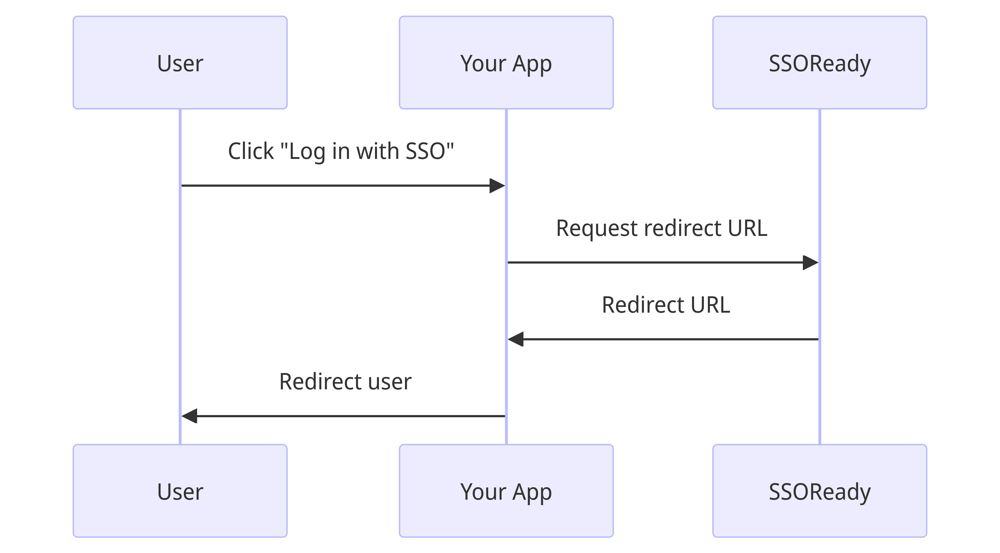
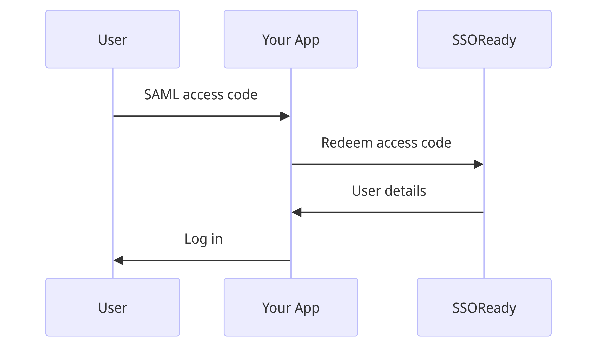

# Getting started with SSOReady

Welcome to the SSOReady quickstart guide! This guide will take you through:

1. [**Basic concepts.**](#basic-concepts) How Enterprise SSO / SAML works at a high level, and how SSOReady will help you implement it.
2. [**Code implementation.**](#code-implementation) What you'll need to build, and how to use SSOReady's SDK.
3. [**Onboarding customers.**](#onboarding-customers) SAML requires both you and your customer do setup. SSOReady automates your end of the equation,
and this section describes what instructions you'll give to your customers.

SSOReady is just an authentication middleware layer. SSOReady doesn't "own" your users, and it doesn't require you to use any
particular tech stack. That's on purpose -- it makes onboarding easier for you, and it forces us to keep earning your business in the long run, because churning is easier.

# Basic concepts

"Enterprise SSO" is mostly a synonym for a protocol called
[SAML](https://en.wikipedia.org/wiki/Security_Assertion_Markup_Language). It's a way for a company to easily let their
employees log into all their software products, including your product.

At smaller companies, employees use username+password or "Log in with Google" to sign into your product. At
larger companies, employees instead expect to use services like Okta or Microsoft Entra (formerly "Azure AD") to do
sign-in. Those sign-ins happen using the SAML protocol. SSOReady makes it way easier to implement SAML.

SAML logins have two steps:

1. You [**initiate a SAML login**](#initiating-saml-logins) by redirecting your user to their corporate Okta/Google/Microsoft.
2. Their corporate Okta/Google/Microsoft redirects your user back to your app, and you [**handle the SAML login**](#handling-saml-logins).

Before this can happen, you and your customer need to exchange settings about each other. This process is done offline;
you'll give your customer some settings that SSOReady provides for you, and you'll email your customer asking for some
settings in return which you'll input into SSOReady.

We'll cover how to do (1) and (2) in [Code implementation](#code-implementation). We'll cover the setup work you'll need
to do inside SSOReady's webapp in [Setting up SSOReady](#setting-up-ssoready). We'll cover the settings you'll give and
ask for in [Onboarding customers](#onboarding-customers).

# Code implementation

As covered in [Basic concepts](#basic-concepts), there are two steps involved in implementing SAML: initiating SAML
logins, and handling SAML logins. Here's how you do each.

## Initiating SAML logins



Under the hood, initiating SAML logins requires you to get your user's browser to perform an HTTP POST against their
corporate Okta/Google/Microsoft with a specific XML message. SSOReady abstracts all this work away into you just needing
to redirect your user to a URL.

SSOReady's SDKs generate a URL for you, and then you simply forward your user to that URL using any mechanism that suits
your tech stack.

```bash cURL
curl https://api.ssoready.com/v1/saml/redirect \
  -H "Content-Type: application/json" \
  -H "Authorization: Bearer ssoready_sk_..." \
  -d '{ "organizationExternalId": "..." }'
```

That code sample requires an API Key (`ssoready_sk_...`) and an `organizationExternalId`. How you get those is covered
in [Setting up SSOReady](#setting-up-ssoready) later on this page.

## Handling SAML logins



Under the hood, SAML login details are sent to you in the form of your user's web browser POST-ing you an XML message.
You would then need to [authenticate that message](https://www.w3.org/TR/xmldsig-core1/) before logging your user in.

SSOReady abstracts this away; we handle authenticating the message, and instead forward your user to a callback page on
your webapp with a "SAML access code", which you can redeem in exchange for authenticated details about the user.

So what you'll need to do is create a new "SSOReady callback page" (typically something like
`https://app.yourcompany.com/ssoready-callback`), where you'll expect a `?saml_access_code=saml_access_code_...` query parameter in the URL.
From your backend, you'll exchange that access code for a user's details:

```bash cURL
curl https://api.ssoready.com/v1/saml/redeem \
  -H "Content-Type: application/json" \
  -H "Authorization: Bearer ssoready_sk_..." \
  -d '{ "samlAccessCode": "saml_access_code_..." }'
```

The response will include the user's `email` as well as the SSOReady `organizationId` and `organizationExternalId`
they belong to. It's your responsibility to then log the user in with that given email and organization using whatever
mechanism your tech stack uses.

How you tell us about your desired "SSOReady callback page", as well as what `organizationId` and
`organizationExternalId` mean, is covered in [Setting up SSOReady](#setting-up-ssoready) below.

# Setting up SSOReady

In [Code implementation](#code-implementation), there were three missing pieces that you'd need to implement SSOReady:

1. **Where does the SSOReady callback page get configured?** That information lives on [environments](#creating-environments).
2. **Where do I get an API key?** You create [an API key](#creating-api-keys) scoped to an environment.
3. **How do I get `organizationExternalId`?** You create [an organization](#creating-organizations) in an environment,
where you can choose an external ID convenient for you.

This section will step you through how you'll do all of this setup in SSOReady's webapp. As a prerequisite step, you'll
need to [sign up to SSOReady](https://app.ssoready.com/login). It's free and anyone can sign up, even with a personal
email.

## Creating environments

To create an environment, go [here](https://app.ssoready.com/environments/new). You'll typically create one environment
per deployment environment, e.g. one each for "production", "staging", and "local dev". On an environment, you'll assign
a "Redirect URL". That's the URL your users get redirected to in ["Handling SAML logins"](#handling-saml-logins).

## Creating API keys

API keys are scoped to an environment. When viewing an environment in the app, click "API Keys" on the left
navbar. Then click "Create API Key". A popup will show you your new API key's secret (it starts with `ssoready_sk_...`). That's the API key you'll
use in ["Initiating SAML Logins"](#initiating-saml-logins) and ["Handling SAML Logins"](#handling-saml-logins).

## Creating organizations

An organization corresponds to a corporate customer of yours. If you sold your product to Apple, Nvidia, and Amazon,
you'd have three organizations in SSOReady: one each for Apple, Nvidia, and Amazon.

Organizations belong to an environment. When viewing an environment in the app, the "Create organization" button creates
a new organization. Organizations have two properties worth highlighting:

* An optional *external ID*, which you can assign. If you're selling multi-tenant B2B software, you probably already
have a concept that closely matches an SSOReady organization -- usually, this is something named a "team", "workspace",
"company", or something similar. When creating an SSOReady organization, use your product's counterpart to an
organization ID as the external ID.

You'll provide the external ID as the `organizationExternalId` in ["Initiating SAML
logins"](#initiating-saml-logins). The external ID is returned to you when ["Redeeming SAML
logins"](#redeeming-saml-logins).
* A set of *domains*. If you expect Apple's employees will log in to your product from `@apple.com` and `@shazam.com`
email addresses, then put `apple.com` and `shazam.com` here. SSOReady will enforce that users' SAML logins come from
these domains.

## Creating SAML connections

A SAML connection holds onto SAML-related settings. In ["Onboarding customers"](#onboarding-customers), you'll be
providing and asking for settings. Those settings all live on an SSOReady SAML connection.

SAML connections belong to an organization. When viewing an organization in the app, the "Create SAML connection" button
creates a new SAML connection. Beyond the SAML-related settings covered in ["Onboarding
customers"](#onboarding-customers), SAML connections have one setting of note: whether they are *primary*.

Each organization has up to one primary SAML connection. In ["Initiating SAML logins"](#initiating-saml-logins), you
provide an `organizationExternalId`. SSOReady will use that organization's primary SAML connection to initiate the
login.

# Onboarding customers

In [Basic concepts](#basic-concepts), we mentioned that you and your customer need to exchange details about each other
before you can do SAML logins. This process happens offline -- there's no coding involved.

Unfortunately, SAML identity providers (e.g. Okta, Microsoft Entra, Google Workspace, etc.) don't use the same
terminology for these identical details. To deal with that, we've prepared a separate set of documentation for you to
follow depending on what identity provider your customer uses:

* [Okta](/docs/idp-configuration/okta)
* [Google Workspace](/docs/idp-configuration/google)
* [Microsoft Entra](/docs/idp-configuration/entra-formerly-azure-ad) (aka Microsoft Azure Active Directory, Microsoft Azure AD)

In all cases, you're ultimately going to:

1. Give your customers an "SP Entity ID" and "SP ACS URL". SSOReady's webapp gives you both.
2. Ask your customers for an "IDP Entity ID", "IDP Redirect URL", and "IDP Certificate" which you input into SSOReady.

Once you have all those details, you'll be ready to accept SAML logins!
