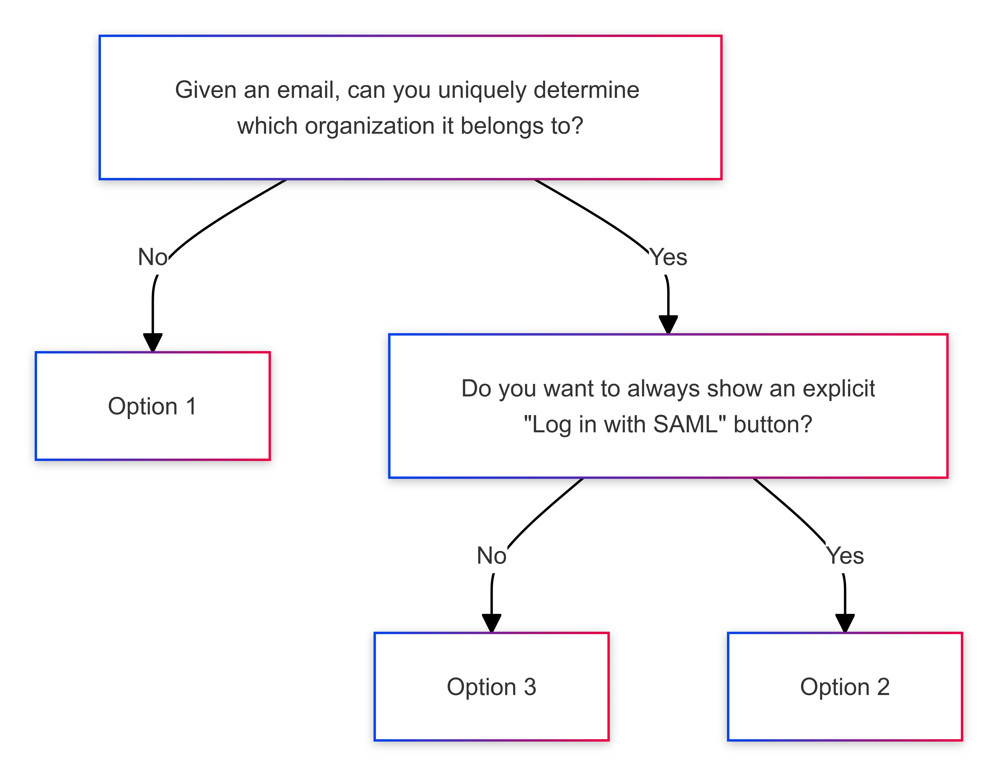
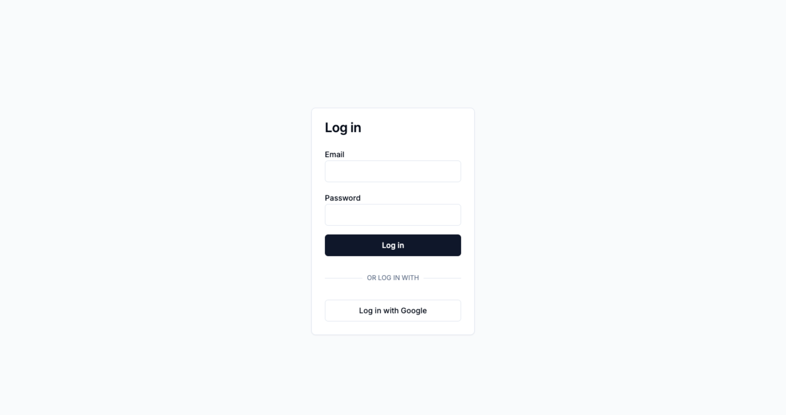
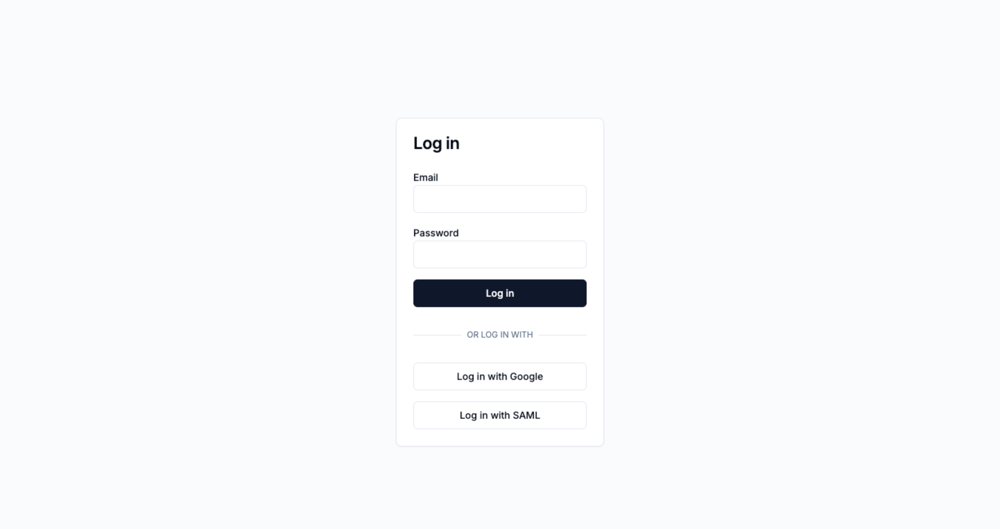
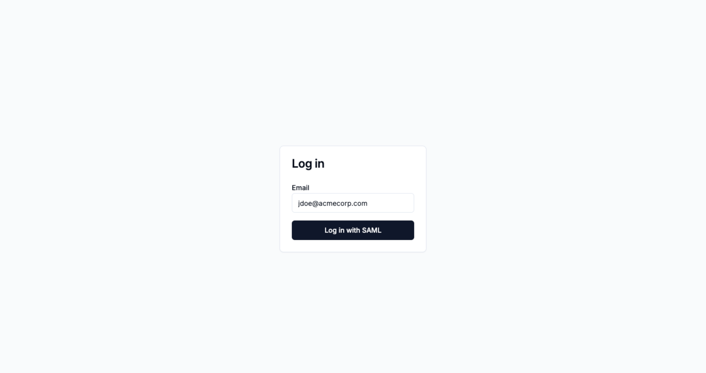
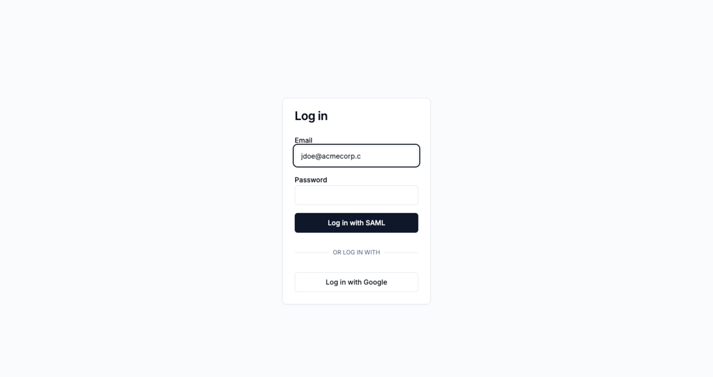

<Note>

This document contains best practices for SAML. You should start with the
[quickstart](/docs/saml/saml-quickstart) first.

</Note>

One of the more subtle aspects of adding SAML to your product is making it a
seamless user experience. This guide will spell out your options, how to decide
which one to go with, and how to implement it.

# Deciding on a user flow

The essential challenge with adding SAML to your product's login experience is
that you need to figure out two things:

1. Does this user need to log in over SAML?
2. If they do need to log in over SAML, which company do they work for?

Every SAML-supporting login experience ultimately is about finding the answer to
these two questions.

This document spells out exactly how to implement the three most popular user
experiences for supporting "Log in with SAML".

1. If you can't uniquely determine which organization an email belongs to, use
   [Option 1: Explicitly ask for SAML and
   Organization](#option-1-explicitly-ask-for-saml-and-organization).
2. If you _can_ determine this, and you want to have an explicit "Log in with
   SAML" button on your login page, choose [Option 2: Explicitly ask for SAML,
   infer organization from
   email](#option-2-explicitly-ask-for-saml-infer-organization-from-email).
3. If you don't care about having an explicit "Log in with SAML" button, or
   would prefer to avoid showing that option unless it's appropriate for a user,
   then choose [Option 3: Infer “Log in with SAML” from
   email](#option-3-infer-log-in-with-saml-from-email).

Or, as a flowchart / decision tree:

<Frame caption="A decision tree for which SAML login UX you should choose.">
  
</Frame>

If you're just looking for the easiest possible way to add "Log in with SAML"
support, that's [Option 1: Explicitly ask for SAML and
Organization](#option-1-explicitly-ask-for-saml-and-organization).

# Option 1: Explicitly ask for SAML and Organization

This is the easiest flow to implement, at the cost of being a bit clunkier for
your customers. Your users will need to know some sort of unique identifier for
their organization inside your product, and you'll use that identifier as the
`organizationExternalId` to initiate a SAML login.

<Steps>
### Start with your login page

<Frame caption="Your initial login page, before SAML, looks something like this.">
  
</Frame>

Identify the page you'll want to modify, and in particular figure out where
you'd like to add a new button for "Sign in with SAML". Typically, this goes
next to any other login providers you may use, e.g. "Log in with Google".

### Add a "Log in with SAML" button

<Frame caption='Your login page, now with a "Sign in with SAML" button.'>
  
</Frame>

Add a new button that takes the user to the next step of the SAML login process
in step (3). Typically, you'll do this by making the "Sign in with SAML" button
a link to a new `/login-saml` page.

### Add a SAML login page asking for an organization ID

<Frame caption="Your new SAML-specific login page, which asks for an organization ID.">
  
</Frame>

On this new page, you'll ask your user to input their organization ID.

### Redirect the user when they click "Log in with SAML"

Create a new endpoint (or GraphQL resolver, RPC method, whatever is easiest for
you) on your backend. That endpoint will:

1. Take the organization ID the user inputted in the above UI,
2. Call SSOReady's [Get SAML Redirect
   URL](/docs/api-reference/saml/get-saml-redirect-url) with the
   given organization ID as the `organizationExternalId` argument to SSOReady.
3. [Get SAML Redirect URL](/docs/api-reference/saml/get-saml-redirect-url)
   returns a URL. Redirect your user to that URL.

</Steps>

# Option 2: Explicitly ask for SAML, infer organization from email

This flow gives your customers a smooth experience for logging in with SAML,
while also letting you explictly offer a "Log in with SAML" button. Users
explicitly opt into logging in with SAML, and you infer which company they
belong to from the email they input.

<Steps>
### Start with your login page

<Frame caption="Your initial login page, before SAML, looks something like this.">
  
</Frame>

Identify the page you'll want to modify, and in particular figure out where
you'd like to add a new button for "Sign in with SAML". Typically, this goes
next to any other login providers you may use, e.g. "Log in with Google".

### Add a "Log in with SAML" button

<Frame caption='Your login page, now with a "Sign in with SAML" button.'>
  
</Frame>

Add a new button that takes the user to the next step of the SAML login process
in step (3). Typically, you'll do this by making the "Sign in with SAML" button
a link to a new `/login-saml` page.

### Add a SAML login page asking for an email

<Frame caption="Your new SAML-specific login page, which asks for an email.">
  
</Frame>

On this new page, you'll ask your user to input their email.

### Redirect the user when they click "Log in with SAML"

Create a new endpoint (or GraphQL resolver, RPC method, whatever is easiest for
you) on your backend. That endpoint will:

1. Take the email the user inputted in the above UI,
2. Figure out an organization ID from that email. This is going to be specific
   to exactly how your product assigns users to organizations. For example, if
   you have one (or a list of) domain(s) tied to every organization, then you
   might look up an organization by the email's domain.
3. Call SSOReady's [Get SAML Redirect
   URL](/docs/api-reference/saml/get-saml-redirect-url) with the organization ID
   from the previous step as the `organizationExternalId` argument to SSOReady.
4. [Get SAML Redirect URL](/docs/api-reference/saml/get-saml-redirect-url)
   returns a URL. Redirect your user to that URL.

</Steps>

# Option 3: Infer "Log in with SAML" from email

This flow lets you avoid having a "Log in with SAML" button on the screen unless
it's appropriate. You automatically detect that SAML needs to happen while the
user starts typing their email address.

<Steps>

### Start with your login page

<Frame caption="Your initial login page, before SAML, looks something like this.">
  
</Frame>

Identify the page you'll want to modify, and in particular figure out where
you'd like to add a new button for "Sign in with SAML". Typically, this goes
next to any other login providers you may use, e.g. "Log in with Google".

### Create an email-to-SAML-organization lookup endpoint

Create a new endpoint (or GraphQL resolver, RPC method, whatever is easiest for
you) on your backend. That endpoint will:

1. Take a user's email,
2. Figure out an organization ID from that email. This is going to be specific
   to exactly how your product assigns users to organizations. For example, if
   you have one (or a list of) domain(s) tied to every organization, then you
   might look up an organization by the email's domain.
3. If no organization is found, or if the organization isn't internally tagged
   as being enabled for SAML, then return some empty value or some error the
   frontend knows means "nothing was found".
4. If you did find an organization that you've internally tagged as having SAML,
   then use SSOReady's [Get SAML Redirect
   URL](/docs/api-reference/saml/get-saml-redirect-url) with the organization's
   ID as the `organizationExternalId` argument to SSOReady.
5. [Get SAML Redirect URL](/docs/api-reference/saml/get-saml-redirect-url)
   returns a URL. Return that URL to your frontend.

### Look up the user's email address for a SAML organization

Either on a continuous basis (e.g. every time the email input changes, maybe
with debouncing) or whenever the user moves focus away from the email input, send
a request to your new enpodint with the inputted email address.

Most of the time, this lookup won't find anything, especially if the user hasn't
finished typing out the email address. In that case, don't do anything special.

<Frame caption='The email lookup for "jdoe@acmecorp.c" didn&apos;t find anything, so nothing special happens.'>
  
</Frame>

But when a lookup does succeed, then remove any password inputs or options for
other kinds of login methods. Change "Log in" to "Log in with SAML".

<Frame caption='The email lookup for "jdoe@acmecorp.com" found an organization with SAML, so the login button becomes SAML-based.'>
  
</Frame>

When a user clicks "Log in with SAML", redirect them to the URL you got back
from your new lookup endpoint from step (2).

</Steps>

# Identity Provider-initiated flows as an escape hatch

The options outlined above are the three most common ways SAML login flows are
implemented by SaaS businesses.

Sometimes, customers will want special logic. Some large company is going to ask
for special logic where `acmecorp.com` and `acmecorp.in` email addresses log
into the same organization, but using a different SAML connection.

You can acquiesce to such requests, but keep in mind that you can also
suggest your customer uses Identity Provider-initiated logins instead.

When you use SSOReady to implement SAML, you get support for Identity
Provider-initiated flows for free. Those work by having your customer log into
your product directly from their Identity Provider. For example, an
Okta-initiated flow consists of clicking on a tile in their Okta with your
company's logo on it.

In most cases, you can use Service Provider-initiated flows, like the ones
described on this page, to make SAML logins easy for most customers. For the
occasional cases where a customer has very specific needs, they are typically
used to having to implement those specific needs using an Identity
Provider-initiated flow.
