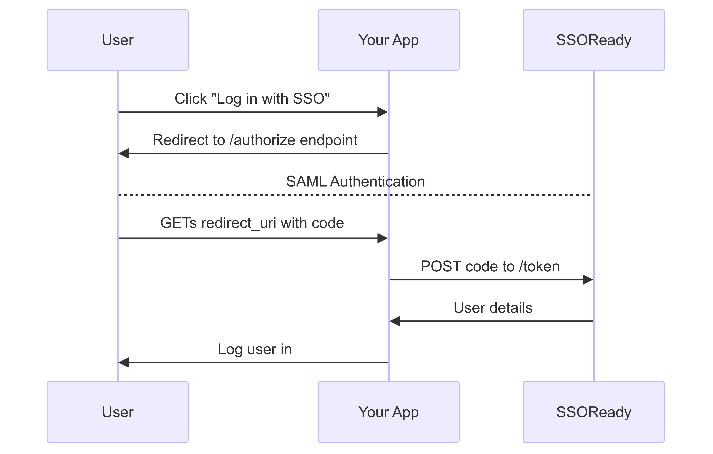

If your application relies primarily on OAuth to log users in, such as if you use
[NextAuth.js](https://next-auth.js.org), then SSOReady's "SAML over OAuth" support makes sense for you to use. This
article will explain how to add SAML support to your OAuth-based application in just a few minutes.

<Note>
    If you're not using NextAuth.js, or if you haven't already committed to only using OAuth to do logins, you will
    probably find the [standard SSOReady API](/docs/introduction/quickstart) easier to use. OAuth introduces its own
    complexity that makes the SAML-over-OAuth integration path a bit more complicated than the standard path.
</Note>

# Getting started with SSOReady

This guide will take you through:

1. [**Basic concepts.**](#basic-concepts) How Enterprise SSO / SAML works at a high level, and how SSOReady will help
you implement it in your OAuth/NextAuth.js-based stack.
2. [**Code implementation.**](#code-implementation) What you'll need to build, and how to use SSOReady's SAML-over-OAuth
provider.
3. [**Onboarding customers.**](#onboarding-customers) SAML requires both you and your customer do setup. SSOReady
automates your end of the equation, and this section describes what instructions you'll give to your customers.

SSOReady is just an authentication middleware layer. SSOReady doesn't "own" your users, and it doesn't require you to use any
particular tech stack. That's on purpose -- it makes onboarding easier for you, and it forces us to keep earning your
business in the long run, because churning is easier.

# Basic Concepts

"Enterprise SSO" is mostly a synonym for a protocol called
[SAML](https://en.wikipedia.org/wiki/Security_Assertion_Markup_Language). It's a way for a company to easily let their
employees log into all their software products, including your product.

At smaller companies, employees use username+password or "Log in with Google" to sign into your product. At
larger companies, employees instead expect to use services like Okta or Microsoft Entra (formerly "Azure AD") to do
sign-in. Those sign-ins happen using the SAML protocol. SSOReady makes it way easier to implement SAML. SSOReady's
OAuth-over-SAML functionality makes SAML fit into existing OAuth-based applications.

SAML logins have two steps:

1. You [**initiate a SAML login**](#initiating-saml-logins) by redirecting your user to their corporate Okta/Google/Microsoft.
2. Their corporate Okta/Google/Microsoft redirects your user back to your app, and you [**handle the SAML login**](#handling-saml-logins).

Before this can happen, you and your customer need to exchange settings about each other. This process is done offline;
you'll give your customer some settings that SSOReady provides for you, and you'll email your customer asking for some
settings in return which you'll input into SSOReady.

We'll cover how to do (1) and (2) in [Code implementation](#code-implementation). We'll cover the setup work you'll need
to do inside SSOReady's webapp in [Setting up SSOReady](#setting-up-ssoready). We'll cover the settings you'll give and
ask for in [Onboarding customers](#onboarding-customers).

# Code implementation

<Frame caption="The SSOReady SAML-over-OAuth flow.">
    
</Frame>

To implement SAML over OAuth, you're going to implement a typical OAuth "Authorization Grant" flow.

<Note>
    If you're using
    NextAuth.js, you can just straight to the ["Code implementation for
    NextAuth.js"](#code-implementation-for-nextauthjs) section below.
</Note>

## Initiating SAML Logins

Under the hood, initiating SAML logins requires you to get your user's browser to perform an HTTP POST against their
corporate Okta/Google/Microsoft with a specific XML message. SSOReady's SAML-over-OAuth flow abstracts this away into a
normal OAuth "authorize" redirect endpoint.

To start a SAML login, redirect your users to this `/authorize` endpoint:

```text
https://auth.ssoready.com/v1/oauth/authorize?client_id=saml_oauth_client_...&organization_external_id=...
```

That URL requires an OAuth client ID (`saml_oauth_client_...`) and an `organization_external_id`. How you get those is
covered in [Setting up SSOReady](#setting-up-ssoready) later on this page.

## Handling SAML Logins

Under the hood, SAML login details are sent to you in the form of your user's web browser POST-ing you an XML message.
You would then need to [authenticate that message](https://www.w3.org/TR/xmldsig-core1/) before logging your user in.

SSOReady abstracts this away; we handle authenticating the message, and instead forward your user to an OAuth redirect
URI on your webapp with a `code` parameter.

So what you'll need to do is create a new "SSOReady OAuth Redirect URI page" (typically something like
`https://app.yourcompany.com/api/auth/callback/ssoready`), where you'll expect a `?code=saml_access_code_...` query
parameter in the URL. From your backend, you'll exchange that access code for a user's details:

```bash cURL
curl https://auth.ssoready.com/v1/oauth/token \
  -d client_id=saml_oauth_client_... \
  -d client_secret=ssoready_oauth_client_secret_... \
  -d code=saml_access_code_...
```

That will return something like this:

```json
{
  "id_token": "..."
}
```

That `id_token` is a [JSON Web Token ("JWT")](https://datatracker.ietf.org/doc/html/rfc7519). The `id_token` is signed
by using an SSOReady RSA private key. You can get the corresponding public key, in [JSON Web
Key Set](https://datatracker.ietf.org/doc/html/rfc7517) form, here:

```text
https://auth.ssoready.com/v1/oauth/jwks
```

Ultimately, the `id_token` will contain the following claims:

```json
{
  // ...
  "organizationExternalId": "...",
  "organizationId": "org_...",
  "sub": "john.doe@example.com"
}
```

In other words, `id_token` will contain claims including the user's `email` as well as the SSOReady `organizationId` and
`organizationExternalId` they belong to. It's your responsibility to then log the user in with that given email and
organization using whatever mechanism your tech stack uses.

How you tell us about your desired "SSOReady OAuth Redirect URI", as well as what `organizationId` and
`organizationExternalId` mean, is covered in [Setting up SSOReady](#setting-up-ssoready) below.

## Code implementation for NextAuth.js

If you're using NextAuth.js, you'll need to add a new `provider` to your `NextAuth` initialization. How you do this
depends on whether you're using `next-auth@v4` (the more common option today) or `next-auth@beta` (also known as
"Auth.js"):

<Tabs>
<Tab title="next-auth@v4 (more common)">
Add the following to wherever you construct your `NextAuth` instance:

```typescript
const handler = NextAuth({
  providers: [
    // add the following provider:
    {
      id: "ssoready-saml",
      name: "SSOReady SAML",
      type: "oauth",
      wellKnown: "https://auth.ssoready.com/v1/oauth/.well-known/openid-configuration",
      profile(profile) {
        return {
          id: profile.sub,
          email: profile.sub,
          organizationId: profile.organizationId,
          organizationExternalId: profile.organizationExternalId,
        }
      },
      clientId: process.env.SSOREADY_CLIENT_ID,
      clientSecret: process.env.SSOREADY_CLIENT_SECRET,
    }
  ],
})
```
</Tab>
<Tab title="next-auth@beta (aka Auth.js)">
Add the following to wherever you construct your `NextAuth` instance:

```typescript
import NextAuth from "next-auth"
import type { OAuthConfig, OAuthUserConfig } from "next-auth/providers"

export interface SSOReadySAMLProfile extends Record<string, any> {
  id: string
  email: string
  organizationId: string
  organizationExternalId: string
}

function SSOReadySAML<P extends SSOReadySAMLProfile>(
  options: OAuthUserConfig<P>
): OAuthConfig<P> {
  return {
    id: "ssoready-saml",
    name: "SSOReady SAML",
    type: "oidc",
    issuer: "https://auth.ssoready.com/v1/oauth",
    profile(profile) {
      return {
        id: profile.sub,
        email: profile.sub,
        organizationId: profile.organizationId,
        organizationExternalId: profile.organizationExternalId,
      }
    },
    client: {
      token_endpoint_auth_method: "client_secret_post",
    }
  }
}

export const { handlers, signIn, signOut, auth } = NextAuth({
  // add the following provider to the list:
  providers: [SSOReadySAML]
})
```
</Tab>
</Tabs>

From there, whenever you want to log a user in, you run:

```typescript
import { signIn } from "next-auth/react"

signIn("ssoready-saml", undefined, { organizationExternalId: "..." })
```

The SSOReady OAuth provider will give you profiles containing an `email`, `organizationId`, and
`organizationExternalId`. `email` is the email of the user who just logged in. What `organizationId` and
`organizationExternalId` mean is covered in [Setting up SSOReady](#setting-up-ssoready) below.

Note that because `organizationExternalId` is required, the default NextAuth.js login page (i.e. at `/api/auth/signin`)
will not work with SSOReady, because that UI does not provide any `organizationExternalId`. This is an intrinsic
constraint of SAML. You must always log in
via SAML *to a particular customer's SAML instance*. That's just how
SAML works. That's why `organizationExternalId` is required.

Finally, you'll also need to add to your `.env` file these values:

<Tabs>
<Tab title="next-auth@v4 (more common)">
```text
SSOREADY_CLIENT_ID=saml_oauth_client_...
SSOREADY_CLIENT_SECRET=ssoready_oauth_client_secret_...
```
</Tab>
<Tab title="next-auth@beta (aka Auth.js)">
```text
AUTH_SSOREADY_SAML_ID=saml_oauth_client_...
AUTH_SSOREADY_SAML_SECRET=ssoready_oauth_client_secret_...
```
</Tab>
</Tabs>

You'll get these environment variable values in ["Creating SAML OAuth clients"](#creating-saml-oauth-clients) below.

# Setting up SSOReady

In [Code implementation](#code-implementation), there were three missing pieces that you'd need to implement SSOReady:

1. **Where does the SSOReady callback page get configured?** That information lives on [environments](#creating-environments).
2. **Where do I get an OAuth client ID and secret?** You create [a SAML OAuth Client](#creating-saml-oauth-clients) scoped to an environment.
3. **How do I get `organizationExternalId`?** You create [an organization](#creating-organizations) in an environment,
where you can choose an external ID convenient for you.

This section will step you through how you'll do all of this setup in SSOReady's webapp. As a prerequisite step, you'll
need to [sign up to SSOReady](https://app.ssoready.com/login). It's free and anyone can sign up, even with a personal
email.

## Creating environments

To create an environment, go [here](https://app.ssoready.com/environments/new). You'll typically create one environment
per deployment environment, e.g. one each for "production", "staging", and "local dev". After creating the environment,
edit it to have an OAuth Redirect URI. That's the URL your users get redirected to in ["Handling SAML
logins"](#handling-saml-logins).

NextAuth.js calls the SSOReady OAuth Redirect URI a "redirect URI" or "callback URL". Its value should be something like:

```text
http://localhost:3000/api/auth/callback/ssoready-saml
```

or

```text
https://yourapp.com/api/auth/callback/ssoready-saml
```

(See [Step 2 of NextAuth.js's OAuth "How-to"](https://next-auth.js.org/configuration/providers/oauth#how-to). The
`[provider]` in this case is `ssoready`.)

## Creating SAML OAuth clients

SAML OAuth Clients are scoped to an environment. When viewing an environment in the app, click "API Keys" on the left
navbar. Then click "Create SAML OAuth Client". A popup will show you your new SAML OAuth client's secret (it starts with
`ssoready_oauth_client_secret_...`). That's
the `client_secret` you'll
use in ["Handling SAML Logins"](#handling-saml-logins) or [in your NextAuth.js config](#code-implementation-for-nextauthjs).

After clicking "View SAML OAuth Client" on that popup, you'll
also see the client's ID (it starts with `saml_oauth_client_...`). That's the `client_id` you'll use in ["Initiating SAML
Logins"](#initiating-saml-logins) and in ["Handling SAML Logins"](#handling-saml-logins), or [in your NextAuth.js config](#code-implementation-for-nextauthjs).

## Creating organizations

An organization corresponds to a corporate customer of yours. If you sold your product to Apple, Nvidia, and Amazon,
you'd have three organizations in SSOReady: one each for Apple, Nvidia, and Amazon.

Organizations belong to an environment. When viewing an environment in the app, the "Create organization" button creates
a new organization. Organizations have two properties worth highlighting:

* An optional *external ID*, which you can assign. If you're selling multi-tenant B2B software, you probably already
have a concept that closely matches an SSOReady organization -- usually, this is something named a "team", "workspace",
"company", or something similar. When creating an SSOReady organization, use your product's counterpart to an
organization ID as the external ID.

You'll provide the external ID as the `organizationExternalId` in ["Initiating SAML
logins"](#initiating-saml-logins). The external ID is returned to you when ["Redeeming SAML
logins"](#redeeming-saml-logins).
* A set of *domains*. If you expect Apple's employees will log in to your product from `@apple.com` and `@shazam.com`
email addresses, then put `apple.com` and `shazam.com` here. SSOReady will enforce that users' SAML logins come from
these domains.

## Creating SAML connections

A SAML connection holds onto SAML-related settings. In ["Onboarding customers"](#onboarding-customers), you'll be
providing and asking for settings. Those settings all live on an SSOReady SAML connection.

SAML connections belong to an organization. When viewing an organization in the app, the "Create SAML connection" button
creates a new SAML connection. Beyond the SAML-related settings covered in ["Onboarding
customers"](#onboarding-customers), SAML connections have one setting of note: whether they are *primary*.

Each organization has up to one primary SAML connection. In ["Initiating SAML logins"](#initiating-saml-logins), you
provide an `organizationExternalId`. SSOReady will use that organization's primary SAML connection to initiate the
login.

# Onboarding customers

In [Basic concepts](#basic-concepts), we mentioned that you and your customer need to exchange details about each other
before you can do SAML logins. This process happens offline -- there's no coding involved.

Unfortunately, SAML identity providers (e.g. Okta, Microsoft Entra, Google Workspace, etc.) don't use the same
terminology for these identical details. To deal with that, we've prepared a separate set of documentation for you to
follow depending on what identity provider your customer uses:

* [Okta](/docs/idp-configuration/okta)
* [Google Workspace](/docs/idp-configuration/google)
* [Microsoft Entra](/docs/idp-configuration/entra-formerly-azure-ad) (aka Microsoft Azure Active Directory, Microsoft Azure AD)

In all cases, you're ultimately going to:

1. Give your customers an "SP Entity ID" and "SP ACS URL". SSOReady's webapp gives you both.
2. Ask your customers for an "IDP Entity ID", "IDP Redirect URL", and "IDP Certificate" which you input into SSOReady.

Once you have all those details, you'll be ready to accept SAML logins!
