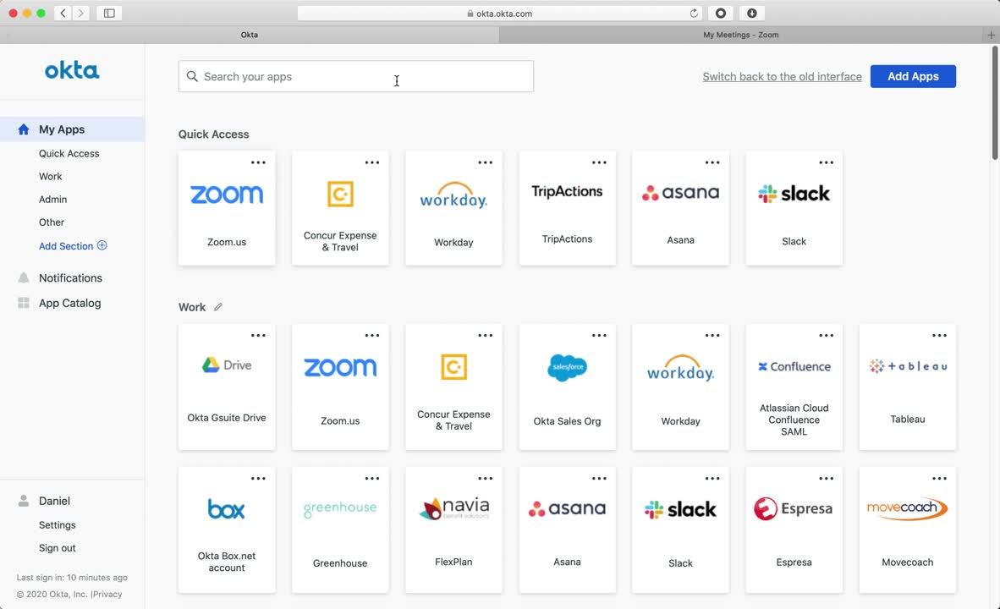
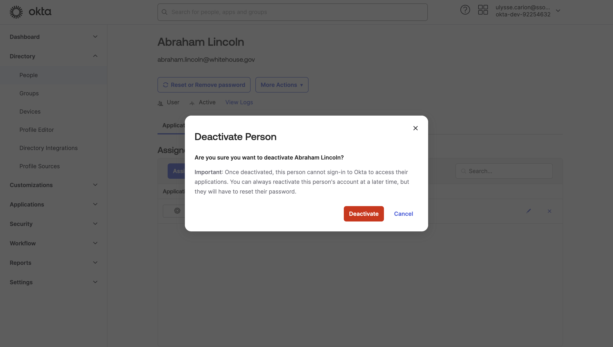
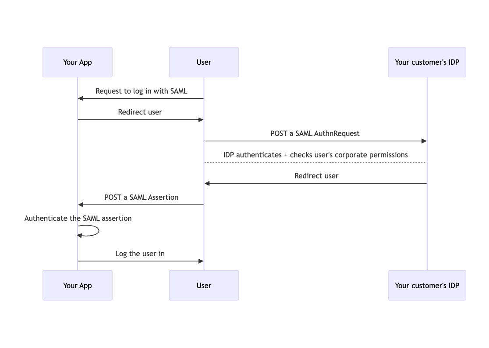
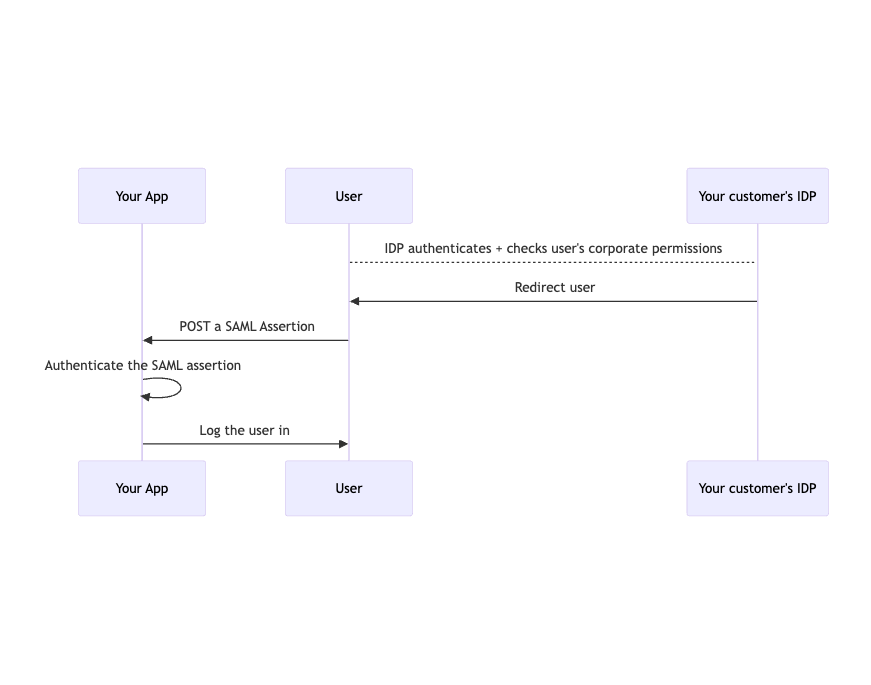

<Note>
    If you just want to start integrating SAML right away, check out the [SAML
    quickstart](/docs/saml/saml-quickstart). You can get a SAML integration
    working end-to-end within a few hours.

    This article is for folks who want to understand SAML at a deeper technical
    level, or how they could implement SAML without using an open-source library
    like SSOReady.
</Note>

[SAML](https://en.wikipedia.org/wiki/Security_Assertion_Markup_Language)
("Security Assertion Markup Language") is a source of a lot of confusion for
developers. This article is a technical primer on some of the most common
questions engineers and other technical folks have about SAML:

1. [Why do businesses want their software vendors to support SAML](#what-is-the-point-of-saml)? In other
words, how does SAML fit into my customer's business? Why do end users and C-level executives at my customer care about SAML?
2. [How should I fit SAML into my existing software](#fitting-saml-into-your-existing-software)? What parts of my software stack
need to be "SAML-aware"? How lightweight can I make my integration? (The answer: quite lightweight. Only a small part of your codebase needs to know about SAML at all.)
3. [At a technical level, how does SAML even work](#saml-at-a-technical-level)? What does the SAML protocol
even do? What kinds of security guarantees does it give me, or what assumptions can I make about it?

# What is the point of SAML?

You care about supporting SAML because your customer wants your product to
support SAML. This is sound reasoning on your part. But why does your customer
want SAML support?

## One click to login: why your users like SAML

Your users probably don't know what SAML is. What they do know about is their
company's *identity provider*. The most popular one is called
[Okta](https://www.okta.com/customer-identity/single-sign-on/); other common
competitors to Okta include [Microsoft
Entra](https://www.microsoft.com/en-us/security/business/identity-access/microsoft-entra-id)
(formerly "Azure Active Directory") and [Google
Workspace](https://workspace.google.com/). There are dozens more vendors in this
space (big companies often build their own internal alternatives), and they all
use the SAML protocol.

Even though your users don't know what SAML or what an identity provider is,
they do love what it gives them: one-click login experience for every SaaS tool
they use at work, a so-called *Single Sign-On* (SSO) experience.

For example, here's what Okta looks like for your users. When your user opens
their computer at work in the morning, this is what they see:

<Frame caption="A screenshot of Okta. Every app they use at work gets a 'tile'. Click on a tile, and you're now logged into it.">
    
</Frame>

At work, your users only need one password: their identity provider password.
They don't need to set up or remember passwords anywhere. They might find
logging into Okta itself a bit annoying, because their IT team requires
two-factor authentication to log into Okta, but logging into everything else is
a breeze.

## One click to fire: why your customer's CISO likes SAML

<Frame caption="A screenshot of an IT admin deprovisioning an Okta user. CISOs love SAML because it lets them lock down all of an employee's accounts from a single place.">
    
</Frame>

Your customer's
[CISO](https://www.cisco.com/c/en/us/products/security/what-is-ciso.html) (Chief
Information Security Officer) is in charge of making sure company data is
secure. Concretely, the biggest things they worry about is:

* Employees accidentally leaking data, because they use the same password
everywhere and that password got breached
* Employees intentionally leaking data, because they were fired and want revenge

CISOs love vendors that support SAML because they can put those vendor's apps
inside the corporate identity provider, e.g. Okta. From there:

* Employees don't need to have a password for that vendor. They just log in
using the identity provider. The identity provider uses the SAML protocol to
securely log the employee into the vendor's app.

* When the company fires someone, an IT admin doesn't have to manually go in and delete that employee's
account from the vendor. Once you remove an employee from Okta, then
Okta will stop letting that employee do SAML-based logins into *anything* (every
identity provider works like this). The fired employee is locked out of every
work application.

But none of this works if your application doesn't implement SAML. SAML is the
protocol that powers single-sign on, which lets identity providers like Okta log
employees into your app without using a password.

This is why many CISOs will go as far as to *require* SAML support out of all
vendors. Many companies have regulatory, contractual, or compliance obligations
to ensure employees don't use insecure passwords and are properly off-boarded
after being fired. CISOs meet those obligations using SAML.

# Fitting SAML into your existing software

<Info>
    If you read [the SAML
    specification](https://docs.oasis-open.org/security/saml/v2.0/saml-core-2.0-os.pdf),
    or look at [documentation written about SAML](https://docs.oasis-open.org/security/saml/Post2.0/sstc-saml-tech-overview-2.0.html)
    (especially if those docs were written in the early 2000s), it might seem like
    SAML is a framework that can subsume or replace all of auth. Don't do this.

    "SAML solves everything" was a hot idea in 2002, but the industry has
    moved away from this. The contemporary consensus is that SAML isn't a great
    protocol. Just use SAML as a way to securely find out what a corporate
    user's email address is.
</Info>

You should think of SAML as a self-contained login method. You probably already
let your users log into your product using things like username+password, email
magic links, "Log in with Google", etc. Think of SAML as another login method.

SAML is a protocol that lets your customer's employees securely prove to you
what their email address is, without you having to worry about sending them
confirmation emails, verifying they're still employed at the company, or that
they belong to the right team at the company.

Roughly speaking, only two parts of your overall system need to know about SAML:

1. Your login page needs to know that SAML is a login option for a customer.
There are a couple common UI flows for doing this. We cover these in depth in
the [Integrating SAML with your Login
UI](/docs/saml/integrating-saml-into-your-login-ui) guide.

    Ultimately, your login page will, at a technical level, [initiate a SAML
    login](#initiating-a-saml-login).

2. Your login backend system needs to be able to [handle SAML
assertions](#handling-a-saml-assertion). We cover this in depth in the [Handling
SAML Logins](/docs/saml/handling-saml-logins-jit-provisioning) guide.

    Ultimately your backend runs an HTTP endpoint, and your user's web browsers
    will POST SAML payloads there. You verify those payloads, and use your
    normal session system (the same one you use for other kinds of logins) to
    create a session for the email you securely extracted from the SAML
    payload.

If you don't use an open-source library like SSOReady to help implement SAML,
the lack of structure that SAML imposes on you -- as well as historical baggage
from the early days of SAML -- can lead you astray in two common
ways:

1. SAML supports the idea of putting "metadata" on a login session,
configuring "conditional access", and lots of other fancy functionality. It
might seem like supporting SAML means having your entire system be able to honor
these advanced SAML-specific features.

    Without getting into too much detail on what
that functionality was meant to achieve in 2002, suffice it to say that most
modern software systems don't use this functionality at all.

    If you treat SAML as just a way to get a user's email, you will be in line
    with almost all other SAML-supporting software your customer is used to.
    CISOs expect, and will be satisfied with, this kind of simple integration.

2. SAML is, unfortunately, much more annoying to configure than any other login
method you already support. The technical details of these SAML settings are
covered later in this article [here](#saml-configuration).

    You and your customer need to exchange settings about one another before a SAML
login can even begin. But that configuration
happens "offline" -- if you're not using SSOReady, you'll implement it by
exchanging informal emails with your customer. If you do use SSOReady, you can
have your customer [self-serve configure their SAML
setup](/docs/idp-configuration/enabling-self-service-configuration-for-your-customers).

    You don't typically have to write
any UI or backend code related to configuring SAML configuration, beyond having
some way for your engineers to store the SAML settings you got from your
customer. You just need to store three small pieces on your backend (two strings
plus an X.509 certificate), and those settings change very infrequently.

# SAML at a technical level

<Tip>
    This section gets quite technical. You don't need to understand this
    material to understand how to use SSOReady. This section is, in a way, a
    high-level overview of everything SSOReady abstracts away for you.
</Tip>

At the end of the day, SAML is a protocol that lets one of your users tell you
("assert") their email address using a payload (an "assertion") that is
self-contained. When you get a SAML payload, you can securely know:

1. Which of your corporate customers sent you the payload,
2. What email address, according to that corporate customer, this user has
3. That the corporate customer wants you to log this user in right away

The tricky part about SAML is that you need to watch out for:

1. Forged SAML assertions, wherein an attacker pretends to be one of your
corporate customers
2. Malicious or misconfigured corporate customers sending assertions about other
company's employees, e.g. EvilCorp (`evilcorp.com`) telling you to log someone
in as the CEO of AcmeCorp (`ceo@acmecorp.com`).

If you use SSOReady, these issues are both automatically covered by you.
Otherwise, you'll typically need to implement (2) yourself, and you may want to
audit your SAML
dependency to make sure they adequately handle (1). Sadly, securely
authenticating SAML is tricky, and many libraries [don't do it
right](https://nvd.nist.gov/vuln/detail/CVE-2024-45409).

## The SAML Flow

There are three actors involved in a SAML flow:

1. You are the **service provider** ("SP"). The service provider is software
product being logged into via SAML.

2. Your customer's Okta/Entra/Google/etc is the **identity provider** ("IDP").
The identity provider is responsible for knowing whether a user is a real
employee that wants to log into a product, and for telling service providers
about that information using SAML.

3. The **user** is mostly just along for the ride. In SAML, the SP and the IDP will
redirect the user to each other. The user's browser is responsible for carrying
messages back and forth between the SP and IDP.

<Frame caption="A sequence diagram of a successful SAML login flow.">
    
</Frame>

Logging in via SAML has five high-level steps:

1. You and your customer agree, offline, on some settings about how you're going
to do SAML.
2. When it's time to log in via SAML, you have the user POST a SAML
`AuthnRequest` to your customer's identity provider. This is called "initiating"
a SAML login.
3. Your customer's identity provider handles making sure the user really has
valid corporate credentials. This step is entirely outside your app's
control.
4. The identity provider has the user POST a SAML `Assertion` to your HTTP server.
5. You authenticate that the assertion is legitimate, and then log the user into
your product.

<Tip>
    If you're familiar with OAuth, this flow might sound familiar. The biggest
    difference between SAML and OAuth is how you verify the user after they get
    redirected back to your application.

    In OAuth, your backend server typically takes a `code` from the user, and
    asks the identity provider if this `code` is legitimate, and what the
    underlying user's details are if it is.

    In SAML, your backend server never talks directly to the identity provider.
    You have to look at the assertion and use public-key cryptography to tell if
    the identity provider cryptographically signed the message.
</Tip>

Step (1) is important conceptually, but doesn't require any code. That's covered
in the next section: [SAML Configuration](#saml-configuration). Steps (2) and
(5) are the ones you have to write code for. They're covered in [Initiating a
SAML Login](#initiating-a-saml-login) and [Handling a SAML
Assertion](#handling-a-saml-assertion).

### SP- vs IDP-initiated SAML flows

The discussion above illustrates the "SP-initiated" SAML flow, where your
application (the SP) decides to kick off the SAML flow.

SAML also supports "IDP-initiated" flows, where the IDP kicks off the SAML flow,
and just directly sends the user to your ACS URL with an assertion.

<Frame caption="A sequence diagram of a successful IDP-initiated flow.">
    
</Frame>

The only difference between an SP- and an IDP-initiated flow is that
IDP-initiated flows won't require you to [initiate
them](#initiating-a-saml-login), and as a result don't have [a `RelayState`](#including-a-relaystate). Both
are widely used in
practice.
When you use SSOReady, you get both SP- and IDP-initiated SAML support
automatically.

## SAML Configuration

For each of your customers, you will have five settings associated with the SAML
connection you have with them. These settings are:

* An **Assertion Consumer Service ("ACS") URL**. You assign this value. It's a
URL where you run an HTTP endpoint that's ready to [handle SAML
assertions](#handling-a-saml-assertion). When the identity provider redirects
the user back to your application, they'll send the user to the ACS URL.

* An **SP Entity ID**. You assign this value, and it must be unique for every
customer. It's a generic string, but
conventionally it's formatted as a URL. The identity provider will include this SP
Entity ID in the
assertions it sends you, and you'll use it to ensure the assertion was meant
for *you* and not some other application.

* An **IDP Redirect URL**. The IDP assigns this value. When you [initiate a SAML
login](#initiating-a-saml-login), this is the URL you redirect the user to.

* An **IDP Entity ID**. The IDP assigns this value. It's a generic string, but
conventionally it's formatted as a URL. When you initiate a SAML
login, you include this value so the IDP knows which application is starting
the login. The IDP will include this IDP Entity ID in the assertions it sends
you, and you'll use it to make sure the assertion is coming from the right
identity provider.

* An **IDP Certificate**. The IDP assigns this value. The IDP will use this certificate to
cryptographically sign the assertions it sends you. You will use
this certificate to authenticate that the identity provider really generated the
assertion, and that it wasn't forged or tampered with.

Once you have all of these settings in place, you can begin doing SAML logins.

## Initiating a SAML Login

Initiating a SAML login concretely consists of having your user's web browser
send a POST request with a payload that looks like this:

```xml AuthnRequest.xml
<AuthnRequest xmlns="urn:oasis:names:tc:SAML:2.0:protocol" Version="2.0" IssueInstant="2024-09-23T22:41:38.243Z">
    <Issuer xmlns="urn:oasis:names:tc:SAML:2.0:assertion">
        https://auth.ssoready.com/v1/saml/saml_conn_5jvy8l0lgia5al1a45s9lo977
    </Issuer>
</AuthnRequest>
```

The `Issuer` needs to be equal to the [SP Entity ID](#saml-configuration).

That POST request needs to be pointed at the [IDP Redirect
URL](#saml-configuration). The POST request needs to be a standard HTTP form,
with the `AuthnRequest.xml` being base64-encoded and set as a form field called
`SAMLRequest`.

You can't use a normal HTTP redirect to have your user POST a form to another
URL. The typical workaround is to render your user a form that self-submits
using JavaScript:

```html Self-Submitting SAML Initiation Form
<html>
	<body>
		<form method="POST" action="{{ IDP_REDIRECT_URL }}">
			<input type="hidden" name="SAMLRequest" value="{{ SAML_AUTHN_REQUEST_BASE64_ENCODED }}"></input>
		</form>
		<script>
			document.forms[0].submit();
		</script>
	</body>
</html>
```

### Including a `RelayState`

When initiating a SAML login, you can optionally include a `RelayState`
parameter. You include this data as an additional parameter in the POST request:

```html title="Self-Submitting SAML Initiation Form with a RelayState" {5}
<html>
	<body>
		<form method="POST" action="{{ IDP_REDIRECT_URL }}">
			<input type="hidden" name="SAMLRequest" value="{{ SAML_AUTHN_REQUEST_BASE64_ENCODED }}"></input>
			<input type="hidden" name="RelayState" value="{{ RELAY_STATE }}"></input>
		</form>
		<script>
			document.forms[0].submit();
		</script>
	</body>
</html>
```

Whatever you put in `RelayState` will be echoed back to you when you [handle the
SAML assertion](#handling-a-saml-assertion). The HTTP POST you receive will
contain, alongside the usual `SAMLResponse` entry, a `RelayState` entry.

The typical use-case for `RelayState` is to keep track of what page your user
was on before forced them to log in with SAML. Then, once they're done logging
in with SAML, you redirect the user back to the page they were previously on.

<Warning>
    You can't trust that the `RelayState` you get back from an identity provider
    is the same as the one you chose when initiating the SAML login. An attacker
    can always send you a request with their own `RelayState` instead.

    The most common security risk associated with `RelayState` is when you store
    a URL in that `RelayState`, but don't authenticate its legitimacy. If the
    `RelayState` is allowed to redirect to a URL outside of your web
    application, then you have an [open redirect
    vulnerability](https://cwe.mitre.org/data/definitions/601.html).

    The safest solution is to cryptographically sign the `RelayState` value you
    include in your request using a secret key. When you use SSOReady, every
    `RelayState` is cryptographically authenticated; you do not need to worry
    about the [`state`
    parameter](/docs/ssoready-concepts/saml-login-flows#state) being tampered
    with.
</Warning>

## Handling a SAML Assertion

After you [initiate a SAML login](#initiating-a-saml-login), the user is now on
the identity provider's website. The user then identifies
themselves to the identity provider. Exactly how this works is outside of your
control.

<Info>
Typically, an identity provider will ask for a user's password, and
then may do multi-factor authentication checks. The point of SAML is that your
customer's IT admin decides on their corporate security policy, and their
identity provider implements the logic. Your application doesn't need to worry
about it.
</Info>

If the identity provider decides to not proceed -- maybe the user is fired, or
maybe hasn't been internally authorized to use your application (e.g. your
customer only wants engineers using your app, but the employee works in sales),
then from your perspective, nothing happens. You'll never hear back from the
login attempt. SAML doesn't have a "login attempt failed" mechanism.

But if the login succeeds, then your user's web browser will be redirected back
to your [SAML ACS URL](#saml-configuration). The user will POST you a standard
set of HTML form data. That form data will contain up to two values:

* A `SAMLResponse` element, containing a base64-encoded XML document. This is
the SAML assertion.
* A `RelayState`. This is only included if you [included a `RelayState` in your
initiation request](#including-a-relaystate).

The job of "handling a SAML login" consists of three steps:

1. Authenticating the legitimacy of the SAML payload
2. Deciding whether you want to honor the SAML request
3. Logging the user in

To do any of this, you first need to parse the SAML assertion, and make sense of
its contents.

<Error>
    Give each customer a different ACS URL. That way, you can uniquely determine
    the appropriate [IDP Certificate](#saml-configuration) to use to
    [authenticate the SAML payload](#authenticating-the-signedinfo).

    The typical way to do this is to give every customer a different unique ID,
    and then include that ID in your ACS URL pattern:

    ```
    POST /saml/:CUSTOMER_ID/acs
    ```

    SSOReady uses the [SAML Connection
    ID](/docs/ssoready-concepts/saml-connections#saml-connection-id) to do this.
    Every [SAML connection ACS
    URL](/docs/ssoready-concepts/saml-connections#assertion-consumer-service-acs-url)
    is unique.
</Error>

### Anatomy of a SAML assertion

The previous section discusses how your [ACS URL](#saml-configuration) will
receive an HTML form with a `SAMLResponse`. Here's a real example of such a
`SAMLResponse`, base64-decoded, that came from Okta:

```xml assertion.xml
<?xml version="1.0" encoding="UTF-8"?><saml2p:Response Destination="https://auth.ssoready.com/v1/saml/saml_conn_bttep2j98bp0a30kas2462aek/acs" ID="id23923151776201191671508486" InResponseTo="saml_flow_0esp5wie0qgf848tf2yk8y5ex" IssueInstant="2024-07-19T20:54:07.107Z" Version="2.0" xmlns:saml2p="urn:oasis:names:tc:SAML:2.0:protocol"><saml2:Issuer Format="urn:oasis:names:tc:SAML:2.0:nameid-format:entity" xmlns:saml2="urn:oasis:names:tc:SAML:2.0:assertion">http://www.okta.com/exkig8gdo63cjI4OD5d7</saml2:Issuer><ds:Signature xmlns:ds="http://www.w3.org/2000/09/xmldsig#"><ds:SignedInfo><ds:CanonicalizationMethod Algorithm="http://www.w3.org/2001/10/xml-exc-c14n#"/><ds:SignatureMethod Algorithm="http://www.w3.org/2001/04/xmldsig-more#rsa-sha256"/><ds:Reference URI="#id23923151776201191671508486"><ds:Transforms><ds:Transform Algorithm="http://www.w3.org/2000/09/xmldsig#enveloped-signature"/><ds:Transform Algorithm="http://www.w3.org/2001/10/xml-exc-c14n#"/></ds:Transforms><ds:DigestMethod Algorithm="http://www.w3.org/2001/04/xmlenc#sha256"/><ds:DigestValue>LG8xAT5bB2FL8o080efFIvlxSgxo+XbHe7jpD0Zhboo=</ds:DigestValue></ds:Reference></ds:SignedInfo><ds:SignatureValue>Pywv2l94wmFtmPgmUKSF7Q4gPPQbrWXTejp2FDHbm5g5NGBouUrYPKGcSfrysG/TUaUZevLiFc8VdkqUcThz+bPFgyt/ePomTJ1e2DfvAptK3wHjXYF88lZwk+p3JtJNohjfiq8wqEauSvM1jPpRfML3k5vOZS/diEzvrzaiB2noyupFZcCbgxSrdAdeVC6sjsUFu96FgjvHXwR41BCZftwrAanld7VZJ4P1GI30tJ6vwLh6H9ZvWx8MQ1vgMZuT2IDXifykeCLoo2GKqXyARIJGbzHzLWgRHBZqeDNskZWLg9HWjJy8eWpeye6OLs/7FuEj/GQGd/v8hMGoCL2U0A==</ds:SignatureValue><ds:KeyInfo><ds:X509Data><ds:X509Certificate>MIIDqDCCApCgAwIBAgIGAZDMRerRMA0GCSqGSIb3DQEBCwUAMIGUMQswCQYDVQQGEwJVUzETMBEG
A1UECAwKQ2FsaWZvcm5pYTEWMBQGA1UEBwwNU2FuIEZyYW5jaXNjbzENMAsGA1UECgwET2t0YTEU
MBIGA1UECwwLU1NPUHJvdmlkZXIxFTATBgNVBAMMDGRldi05MjI1NDYzMjEcMBoGCSqGSIb3DQEJ
ARYNaW5mb0Bva3RhLmNvbTAeFw0yNDA3MTkxODMzMTJaFw0zNDA3MTkxODM0MTJaMIGUMQswCQYD
VQQGEwJVUzETMBEGA1UECAwKQ2FsaWZvcm5pYTEWMBQGA1UEBwwNU2FuIEZyYW5jaXNjbzENMAsG
A1UECgwET2t0YTEUMBIGA1UECwwLU1NPUHJvdmlkZXIxFTATBgNVBAMMDGRldi05MjI1NDYzMjEc
MBoGCSqGSIb3DQEJARYNaW5mb0Bva3RhLmNvbTCCASIwDQYJKoZIhvcNAQEBBQADggEPADCCAQoC
ggEBALnkZbxmKDN9vSl7vwR1GgHXRLCQmvItOM8mbF19EUlx12tXzmA1wmafxZBo8+Zr7v4N9K+m
MPWlpNr9MKO0wUkrsv9NzuQeRXowHVsiQ6O2Vaxsb1o9kxjpR/Cego/sT2Cw2A8sACeQhWoQoe1h
jHOzIfvKf2OBpQ/BaelRCqZbYE9doZc1ufEp9xz6nSFRwJbF37pPo89qGeFPrYbsJkydysOM8SKO
On55UI8dv0iI0msQvBegPa1Bvauex0/UcIq6o6N9wc03pq26OulcXC5rKuUeNTnmA7mX04wOC+a2
jBe64W3aEGDCqk+ulw5hv8zsBAuD4vYsuRYkTCVtOgUCAwEAATANBgkqhkiG9w0BAQsFAAOCAQEA
V+Mp98LuveJp4xFsC+6kv0f6w9HXDb/2KbUWiqxsocuJ9E+YEJv3tNC7F9uivvgGNah3hJENlin0
+5wZqY59cNYRhl227lLPJUS7XGNnlN0QG9ns0tgjgWB4e/yQbxoy+e9wzj+MKrurmkNEaZiymo+Y
OiSQuxQVw/JiZgifjNMIYmxF/12sKfn/6VHfhBAxDaUWLWzPq410On7KlOEb6FwIudRAaIL1NE2y
LckoOiWYbmZJt1A5d+2IwdGCoH6GIsu3Dp990YISiC1rCg4pFI4s3d+VEaVn1udKv3f/UMnNTOz0
jn3ZKSxD7x5NuHm8zEcDnxTiSXxkSs9RpZqrUg==</ds:X509Certificate></ds:X509Data></ds:KeyInfo></ds:Signature><saml2p:Status xmlns:saml2p="urn:oasis:names:tc:SAML:2.0:protocol"><saml2p:StatusCode Value="urn:oasis:names:tc:SAML:2.0:status:Success"/></saml2p:Status><saml2:Assertion ID="id23923151778251751045676989" IssueInstant="2024-07-19T20:54:07.107Z" Version="2.0" xmlns:saml2="urn:oasis:names:tc:SAML:2.0:assertion"><saml2:Issuer Format="urn:oasis:names:tc:SAML:2.0:nameid-format:entity" xmlns:saml2="urn:oasis:names:tc:SAML:2.0:assertion">http://www.okta.com/exkig8gdo63cjI4OD5d7</saml2:Issuer><ds:Signature xmlns:ds="http://www.w3.org/2000/09/xmldsig#"><ds:SignedInfo><ds:CanonicalizationMethod Algorithm="http://www.w3.org/2001/10/xml-exc-c14n#"/><ds:SignatureMethod Algorithm="http://www.w3.org/2001/04/xmldsig-more#rsa-sha256"/><ds:Reference URI="#id23923151778251751045676989"><ds:Transforms><ds:Transform Algorithm="http://www.w3.org/2000/09/xmldsig#enveloped-signature"/><ds:Transform Algorithm="http://www.w3.org/2001/10/xml-exc-c14n#"/></ds:Transforms><ds:DigestMethod Algorithm="http://www.w3.org/2001/04/xmlenc#sha256"/><ds:DigestValue>5dyl0RFX07wyxI7u6Gw8u/GnO198XDNyj72TJY0KqLc=</ds:DigestValue></ds:Reference></ds:SignedInfo><ds:SignatureValue>gEacn07XIGlNYhgL4FO5BvK2qeulGDgLfV6LXQoZV9shUbreHrK2C9sYCBECDrCJfFzsT8PLcbcK2DgEG34Zzl1RI893Qc+hMxvl/SQ/rli7EL4bE9t1tIYHLr5d88NKXqoixNcVwf1GYkDt8xw4NjS6i7cfnIgOnJ7TjdJVtLSMNjF+yOXbzEVG7oOE618eIb0GrVk21eEOhlHl+rGiaheyzJaaX3zKTISJjcS9195bhe1v4D8XMGVj4AJO73JLpMfs3v7QArgrhQNAlbCsysdlqUAIaZBEWJgjE/k2W38jzm728wFUsewHwbKt4k060CKQ5Y6/0Wexq/7PhEN78A==</ds:SignatureValue><ds:KeyInfo><ds:X509Data><ds:X509Certificate>MIIDqDCCApCgAwIBAgIGAZDMRerRMA0GCSqGSIb3DQEBCwUAMIGUMQswCQYDVQQGEwJVUzETMBEG
A1UECAwKQ2FsaWZvcm5pYTEWMBQGA1UEBwwNU2FuIEZyYW5jaXNjbzENMAsGA1UECgwET2t0YTEU
MBIGA1UECwwLU1NPUHJvdmlkZXIxFTATBgNVBAMMDGRldi05MjI1NDYzMjEcMBoGCSqGSIb3DQEJ
ARYNaW5mb0Bva3RhLmNvbTAeFw0yNDA3MTkxODMzMTJaFw0zNDA3MTkxODM0MTJaMIGUMQswCQYD
VQQGEwJVUzETMBEGA1UECAwKQ2FsaWZvcm5pYTEWMBQGA1UEBwwNU2FuIEZyYW5jaXNjbzENMAsG
A1UECgwET2t0YTEUMBIGA1UECwwLU1NPUHJvdmlkZXIxFTATBgNVBAMMDGRldi05MjI1NDYzMjEc
MBoGCSqGSIb3DQEJARYNaW5mb0Bva3RhLmNvbTCCASIwDQYJKoZIhvcNAQEBBQADggEPADCCAQoC
ggEBALnkZbxmKDN9vSl7vwR1GgHXRLCQmvItOM8mbF19EUlx12tXzmA1wmafxZBo8+Zr7v4N9K+m
MPWlpNr9MKO0wUkrsv9NzuQeRXowHVsiQ6O2Vaxsb1o9kxjpR/Cego/sT2Cw2A8sACeQhWoQoe1h
jHOzIfvKf2OBpQ/BaelRCqZbYE9doZc1ufEp9xz6nSFRwJbF37pPo89qGeFPrYbsJkydysOM8SKO
On55UI8dv0iI0msQvBegPa1Bvauex0/UcIq6o6N9wc03pq26OulcXC5rKuUeNTnmA7mX04wOC+a2
jBe64W3aEGDCqk+ulw5hv8zsBAuD4vYsuRYkTCVtOgUCAwEAATANBgkqhkiG9w0BAQsFAAOCAQEA
V+Mp98LuveJp4xFsC+6kv0f6w9HXDb/2KbUWiqxsocuJ9E+YEJv3tNC7F9uivvgGNah3hJENlin0
+5wZqY59cNYRhl227lLPJUS7XGNnlN0QG9ns0tgjgWB4e/yQbxoy+e9wzj+MKrurmkNEaZiymo+Y
OiSQuxQVw/JiZgifjNMIYmxF/12sKfn/6VHfhBAxDaUWLWzPq410On7KlOEb6FwIudRAaIL1NE2y
LckoOiWYbmZJt1A5d+2IwdGCoH6GIsu3Dp990YISiC1rCg4pFI4s3d+VEaVn1udKv3f/UMnNTOz0
jn3ZKSxD7x5NuHm8zEcDnxTiSXxkSs9RpZqrUg==</ds:X509Certificate></ds:X509Data></ds:KeyInfo></ds:Signature><saml2:Subject xmlns:saml2="urn:oasis:names:tc:SAML:2.0:assertion"><saml2:NameID Format="urn:oasis:names:tc:SAML:1.1:nameid-format:unspecified">ulysse.carion@ssoready.com</saml2:NameID><saml2:SubjectConfirmation Method="urn:oasis:names:tc:SAML:2.0:cm:bearer"><saml2:SubjectConfirmationData InResponseTo="saml_flow_0esp5wie0qgf848tf2yk8y5ex" NotOnOrAfter="2024-07-19T20:59:07.108Z" Recipient="https://auth.ssoready.com/v1/saml/saml_conn_bttep2j98bp0a30kas2462aek/acs"/></saml2:SubjectConfirmation></saml2:Subject><saml2:Conditions NotBefore="2024-07-19T20:49:07.108Z" NotOnOrAfter="2024-07-19T20:59:07.108Z" xmlns:saml2="urn:oasis:names:tc:SAML:2.0:assertion"><saml2:AudienceRestriction><saml2:Audience>https://auth.ssoready.com/v1/saml/saml_conn_bttep2j98bp0a30kas2462aek</saml2:Audience></saml2:AudienceRestriction></saml2:Conditions><saml2:AuthnStatement AuthnInstant="2024-07-19T20:54:07.107Z" SessionIndex="saml_flow_0esp5wie0qgf848tf2yk8y5ex" xmlns:saml2="urn:oasis:names:tc:SAML:2.0:assertion"><saml2:AuthnContext><saml2:AuthnContextClassRef>urn:oasis:names:tc:SAML:2.0:ac:classes:PasswordProtectedTransport</saml2:AuthnContextClassRef></saml2:AuthnContext></saml2:AuthnStatement></saml2:Assertion></saml2p:Response>
```

When we later [authenticate the SAML
assertion](#cryptographically-authenticating-a-saml-assertion), this is the
payload we will be authenticating. Whitespace matters.

But for the purposes of human legibility, let's look at it in a prettier form:

```xml assertion.xml (Pretty-Indented)
<?xml version="1.0" encoding="UTF-8"?>
<saml2p:Response Destination="https://auth.ssoready.com/v1/saml/saml_conn_bttep2j98bp0a30kas2462aek/acs" ID="id23923151776201191671508486" InResponseTo="saml_flow_0esp5wie0qgf848tf2yk8y5ex" IssueInstant="2024-07-19T20:54:07.107Z" Version="2.0" xmlns:saml2p="urn:oasis:names:tc:SAML:2.0:protocol">
    <saml2:Issuer Format="urn:oasis:names:tc:SAML:2.0:nameid-format:entity" xmlns:saml2="urn:oasis:names:tc:SAML:2.0:assertion">
        http://www.okta.com/exkig8gdo63cjI4OD5d7
    </saml2:Issuer>
    <ds:Signature xmlns:ds="http://www.w3.org/2000/09/xmldsig#">
        <ds:SignedInfo>
            <ds:CanonicalizationMethod Algorithm="http://www.w3.org/2001/10/xml-exc-c14n#"/>
            <ds:SignatureMethod Algorithm="http://www.w3.org/2001/04/xmldsig-more#rsa-sha256"/>
            <ds:Reference URI="#id23923151776201191671508486">
                <ds:Transforms>
                    <ds:Transform Algorithm="http://www.w3.org/2000/09/xmldsig#enveloped-signature"/>
                    <ds:Transform Algorithm="http://www.w3.org/2001/10/xml-exc-c14n#"/>
                </ds:Transforms>
                <ds:DigestMethod Algorithm="http://www.w3.org/2001/04/xmlenc#sha256"/>
                <ds:DigestValue>
                    LG8xAT5bB2FL8o080efFIvlxSgxo+XbHe7jpD0Zhboo=
                </ds:DigestValue>
            </ds:Reference>
        </ds:SignedInfo>
        <ds:SignatureValue>
            Pywv2l94wmFtmPgmUKSF7Q4gPPQbrWXTejp2FDHbm5g5NGBouUrYPKGcSfrysG/TUaUZevLiFc8VdkqUcThz+bPFgyt/ePomTJ1e2DfvAptK3wHjXYF88lZwk+p3JtJNohjfiq8wqEauSvM1jPpRfML3k5vOZS/diEzvrzaiB2noyupFZcCbgxSrdAdeVC6sjsUFu96FgjvHXwR41BCZftwrAanld7VZJ4P1GI30tJ6vwLh6H9ZvWx8MQ1vgMZuT2IDXifykeCLoo2GKqXyARIJGbzHzLWgRHBZqeDNskZWLg9HWjJy8eWpeye6OLs/7FuEj/GQGd/v8hMGoCL2U0A==
        </ds:SignatureValue>
        <ds:KeyInfo>
            <ds:X509Data>
                <ds:X509Certificate>
                    MIIDqDCCApCgAwIBAgIGAZDMRerRMA0GCSqGSIb3DQEBCwUAMIGUMQswCQYDVQQGEwJVUzETMBEG
                    A1UECAwKQ2FsaWZvcm5pYTEWMBQGA1UEBwwNU2FuIEZyYW5jaXNjbzENMAsGA1UECgwET2t0YTEU
                    MBIGA1UECwwLU1NPUHJvdmlkZXIxFTATBgNVBAMMDGRldi05MjI1NDYzMjEcMBoGCSqGSIb3DQEJ
                    ARYNaW5mb0Bva3RhLmNvbTAeFw0yNDA3MTkxODMzMTJaFw0zNDA3MTkxODM0MTJaMIGUMQswCQYD
                    VQQGEwJVUzETMBEGA1UECAwKQ2FsaWZvcm5pYTEWMBQGA1UEBwwNU2FuIEZyYW5jaXNjbzENMAsG
                    A1UECgwET2t0YTEUMBIGA1UECwwLU1NPUHJvdmlkZXIxFTATBgNVBAMMDGRldi05MjI1NDYzMjEc
                    MBoGCSqGSIb3DQEJARYNaW5mb0Bva3RhLmNvbTCCASIwDQYJKoZIhvcNAQEBBQADggEPADCCAQoC
                    ggEBALnkZbxmKDN9vSl7vwR1GgHXRLCQmvItOM8mbF19EUlx12tXzmA1wmafxZBo8+Zr7v4N9K+m
                    MPWlpNr9MKO0wUkrsv9NzuQeRXowHVsiQ6O2Vaxsb1o9kxjpR/Cego/sT2Cw2A8sACeQhWoQoe1h
                    jHOzIfvKf2OBpQ/BaelRCqZbYE9doZc1ufEp9xz6nSFRwJbF37pPo89qGeFPrYbsJkydysOM8SKO
                    On55UI8dv0iI0msQvBegPa1Bvauex0/UcIq6o6N9wc03pq26OulcXC5rKuUeNTnmA7mX04wOC+a2
                    jBe64W3aEGDCqk+ulw5hv8zsBAuD4vYsuRYkTCVtOgUCAwEAATANBgkqhkiG9w0BAQsFAAOCAQEA
                    V+Mp98LuveJp4xFsC+6kv0f6w9HXDb/2KbUWiqxsocuJ9E+YEJv3tNC7F9uivvgGNah3hJENlin0
                    +5wZqY59cNYRhl227lLPJUS7XGNnlN0QG9ns0tgjgWB4e/yQbxoy+e9wzj+MKrurmkNEaZiymo+Y
                    OiSQuxQVw/JiZgifjNMIYmxF/12sKfn/6VHfhBAxDaUWLWzPq410On7KlOEb6FwIudRAaIL1NE2y
                    LckoOiWYbmZJt1A5d+2IwdGCoH6GIsu3Dp990YISiC1rCg4pFI4s3d+VEaVn1udKv3f/UMnNTOz0
                    jn3ZKSxD7x5NuHm8zEcDnxTiSXxkSs9RpZqrUg==
                </ds:X509Certificate>
            </ds:X509Data>
        </ds:KeyInfo>
    </ds:Signature>
    <saml2p:Status xmlns:saml2p="urn:oasis:names:tc:SAML:2.0:protocol">
        <saml2p:StatusCode Value="urn:oasis:names:tc:SAML:2.0:status:Success"/>
    </saml2p:Status>
    <saml2:Assertion ID="id23923151778251751045676989" IssueInstant="2024-07-19T20:54:07.107Z" Version="2.0" xmlns:saml2="urn:oasis:names:tc:SAML:2.0:assertion">
        <saml2:Issuer Format="urn:oasis:names:tc:SAML:2.0:nameid-format:entity" xmlns:saml2="urn:oasis:names:tc:SAML:2.0:assertion">
            http://www.okta.com/exkig8gdo63cjI4OD5d7
        </saml2:Issuer>
        <ds:Signature xmlns:ds="http://www.w3.org/2000/09/xmldsig#">
            <ds:SignedInfo>
                <ds:CanonicalizationMethod Algorithm="http://www.w3.org/2001/10/xml-exc-c14n#"/>
                <ds:SignatureMethod Algorithm="http://www.w3.org/2001/04/xmldsig-more#rsa-sha256"/>
                <ds:Reference URI="#id23923151778251751045676989">
                    <ds:Transforms>
                        <ds:Transform Algorithm="http://www.w3.org/2000/09/xmldsig#enveloped-signature"/>
                        <ds:Transform Algorithm="http://www.w3.org/2001/10/xml-exc-c14n#"/>
                    </ds:Transforms>
                    <ds:DigestMethod Algorithm="http://www.w3.org/2001/04/xmlenc#sha256"/>
                    <ds:DigestValue>
                        5dyl0RFX07wyxI7u6Gw8u/GnO198XDNyj72TJY0KqLc=
                    </ds:DigestValue>
                </ds:Reference>
            </ds:SignedInfo>
            <ds:SignatureValue>
                gEacn07XIGlNYhgL4FO5BvK2qeulGDgLfV6LXQoZV9shUbreHrK2C9sYCBECDrCJfFzsT8PLcbcK2DgEG34Zzl1RI893Qc+hMxvl/SQ/rli7EL4bE9t1tIYHLr5d88NKXqoixNcVwf1GYkDt8xw4NjS6i7cfnIgOnJ7TjdJVtLSMNjF+yOXbzEVG7oOE618eIb0GrVk21eEOhlHl+rGiaheyzJaaX3zKTISJjcS9195bhe1v4D8XMGVj4AJO73JLpMfs3v7QArgrhQNAlbCsysdlqUAIaZBEWJgjE/k2W38jzm728wFUsewHwbKt4k060CKQ5Y6/0Wexq/7PhEN78A==
            </ds:SignatureValue>
            <ds:KeyInfo>
                <ds:X509Data>
                    <ds:X509Certificate>
                        MIIDqDCCApCgAwIBAgIGAZDMRerRMA0GCSqGSIb3DQEBCwUAMIGUMQswCQYDVQQGEwJVUzETMBEG
                        A1UECAwKQ2FsaWZvcm5pYTEWMBQGA1UEBwwNU2FuIEZyYW5jaXNjbzENMAsGA1UECgwET2t0YTEU
                        MBIGA1UECwwLU1NPUHJvdmlkZXIxFTATBgNVBAMMDGRldi05MjI1NDYzMjEcMBoGCSqGSIb3DQEJ
                        ARYNaW5mb0Bva3RhLmNvbTAeFw0yNDA3MTkxODMzMTJaFw0zNDA3MTkxODM0MTJaMIGUMQswCQYD
                        VQQGEwJVUzETMBEGA1UECAwKQ2FsaWZvcm5pYTEWMBQGA1UEBwwNU2FuIEZyYW5jaXNjbzENMAsG
                        A1UECgwET2t0YTEUMBIGA1UECwwLU1NPUHJvdmlkZXIxFTATBgNVBAMMDGRldi05MjI1NDYzMjEc
                        MBoGCSqGSIb3DQEJARYNaW5mb0Bva3RhLmNvbTCCASIwDQYJKoZIhvcNAQEBBQADggEPADCCAQoC
                        ggEBALnkZbxmKDN9vSl7vwR1GgHXRLCQmvItOM8mbF19EUlx12tXzmA1wmafxZBo8+Zr7v4N9K+m
                        MPWlpNr9MKO0wUkrsv9NzuQeRXowHVsiQ6O2Vaxsb1o9kxjpR/Cego/sT2Cw2A8sACeQhWoQoe1h
                        jHOzIfvKf2OBpQ/BaelRCqZbYE9doZc1ufEp9xz6nSFRwJbF37pPo89qGeFPrYbsJkydysOM8SKO
                        On55UI8dv0iI0msQvBegPa1Bvauex0/UcIq6o6N9wc03pq26OulcXC5rKuUeNTnmA7mX04wOC+a2
                        jBe64W3aEGDCqk+ulw5hv8zsBAuD4vYsuRYkTCVtOgUCAwEAATANBgkqhkiG9w0BAQsFAAOCAQEA
                        V+Mp98LuveJp4xFsC+6kv0f6w9HXDb/2KbUWiqxsocuJ9E+YEJv3tNC7F9uivvgGNah3hJENlin0
                        +5wZqY59cNYRhl227lLPJUS7XGNnlN0QG9ns0tgjgWB4e/yQbxoy+e9wzj+MKrurmkNEaZiymo+Y
                        OiSQuxQVw/JiZgifjNMIYmxF/12sKfn/6VHfhBAxDaUWLWzPq410On7KlOEb6FwIudRAaIL1NE2y
                        LckoOiWYbmZJt1A5d+2IwdGCoH6GIsu3Dp990YISiC1rCg4pFI4s3d+VEaVn1udKv3f/UMnNTOz0
                        jn3ZKSxD7x5NuHm8zEcDnxTiSXxkSs9RpZqrUg==
                    </ds:X509Certificate>
                </ds:X509Data>
            </ds:KeyInfo>
        </ds:Signature>
        <saml2:Subject xmlns:saml2="urn:oasis:names:tc:SAML:2.0:assertion">
            <saml2:NameID Format="urn:oasis:names:tc:SAML:1.1:nameid-format:unspecified">
                ulysse.carion@ssoready.com
            </saml2:NameID>
            <saml2:SubjectConfirmation Method="urn:oasis:names:tc:SAML:2.0:cm:bearer">
                <saml2:SubjectConfirmationData InResponseTo="saml_flow_0esp5wie0qgf848tf2yk8y5ex" NotOnOrAfter="2024-07-19T20:59:07.108Z" Recipient="https://auth.ssoready.com/v1/saml/saml_conn_bttep2j98bp0a30kas2462aek/acs"/>
            </saml2:SubjectConfirmation>
        </saml2:Subject>
        <saml2:Conditions NotBefore="2024-07-19T20:49:07.108Z" NotOnOrAfter="2024-07-19T20:59:07.108Z" xmlns:saml2="urn:oasis:names:tc:SAML:2.0:assertion">
            <saml2:AudienceRestriction>
                <saml2:Audience>
                    https://auth.ssoready.com/v1/saml/saml_conn_bttep2j98bp0a30kas2462aek
                </saml2:Audience>
            </saml2:AudienceRestriction>
        </saml2:Conditions>
        <saml2:AuthnStatement AuthnInstant="2024-07-19T20:54:07.107Z" SessionIndex="saml_flow_0esp5wie0qgf848tf2yk8y5ex" xmlns:saml2="urn:oasis:names:tc:SAML:2.0:assertion">
            <saml2:AuthnContext>
                <saml2:AuthnContextClassRef>
                    urn:oasis:names:tc:SAML:2.0:ac:classes:PasswordProtectedTransport
                </saml2:AuthnContextClassRef>
            </saml2:AuthnContext>
        </saml2:AuthnStatement>
    </saml2:Assertion>
</saml2p:Response>
```

The most important pieces of information are:

* The assertion **issuer** lives in `<saml2:Issuer>`

    ```xml {2}
    <saml2:Issuer Format="urn:oasis:names:tc:SAML:2.0:nameid-format:entity" xmlns:saml2="urn:oasis:names:tc:SAML:2.0:assertion">
        http://www.okta.com/exkig8gdo63cjI4OD5d7
    </saml2:Issuer>
    ```

* The assertion **signature** lives in `<ds:Signature>` (specifically the one
inside `<saml2:Assertion>`). The most important parts are the

    * Canonicalization `Algorithm` on `<ds:CanonicalizationMethod>`
    * Signature `Algorithm` on `<ds:SignatureMethod>`
    * Digest `Algorithm` on `<ds:DigestMethod>`
    * The digest hash in `<ds:DigestValue>`
    * The signature value in `<ds:SignatureValue>`

    ```xml {3,4,10,12,17}
    <ds:Signature xmlns:ds="http://www.w3.org/2000/09/xmldsig#">
        <ds:SignedInfo>
            <ds:CanonicalizationMethod Algorithm="http://www.w3.org/2001/10/xml-exc-c14n#"/>
            <ds:SignatureMethod Algorithm="http://www.w3.org/2001/04/xmldsig-more#rsa-sha256"/>
            <ds:Reference URI="#id23923151778251751045676989">
                <ds:Transforms>
                    <ds:Transform Algorithm="http://www.w3.org/2000/09/xmldsig#enveloped-signature"/>
                    <ds:Transform Algorithm="http://www.w3.org/2001/10/xml-exc-c14n#"/>
                </ds:Transforms>
                <ds:DigestMethod Algorithm="http://www.w3.org/2001/04/xmlenc#sha256"/>
                <ds:DigestValue>
                    5dyl0RFX07wyxI7u6Gw8u/GnO198XDNyj72TJY0KqLc=
                </ds:DigestValue>
            </ds:Reference>
        </ds:SignedInfo>
        <ds:SignatureValue>
            gEacn07XIGlNYhgL4FO5BvK2qeulGDgLfV6LXQoZV9shUbreHrK2C9sYCBECDrCJfFzsT8PLcbcK2DgEG34Zzl1RI893Qc+hMxvl/SQ/rli7EL4bE9t1tIYHLr5d88NKXqoixNcVwf1GYkDt8xw4NjS6i7cfnIgOnJ7TjdJVtLSMNjF+yOXbzEVG7oOE618eIb0GrVk21eEOhlHl+rGiaheyzJaaX3zKTISJjcS9195bhe1v4D8XMGVj4AJO73JLpMfs3v7QArgrhQNAlbCsysdlqUAIaZBEWJgjE/k2W38jzm728wFUsewHwbKt4k060CKQ5Y6/0Wexq/7PhEN78A==
        </ds:SignatureValue>
        <!-- ds:KeyInfo omitted because it's really long -->
    </ds:Signature>
    ```

* The assertion **subject ID** lives in `<saml2:NameID>`

    ```xml {2}
    <saml2:NameID Format="urn:oasis:names:tc:SAML:1.1:nameid-format:unspecified">
        ulysse.carion@ssoready.com
    </saml2:NameID>
    ```

* The assertion's **validity window** is specified by the `NotBefore` and `NotOnOrAfter` on `<saml2:Conditions>`

    ```xml {1}
    <saml2:Conditions NotBefore="2024-07-19T20:49:07.108Z" NotOnOrAfter="2024-07-19T20:59:07.108Z" xmlns:saml2="urn:oasis:names:tc:SAML:2.0:assertion">
        <saml2:AudienceRestriction>
            <saml2:Audience>
                https://auth.ssoready.com/v1/saml/saml_conn_bttep2j98bp0a30kas2462aek
            </saml2:Audience>
        </saml2:AudienceRestriction>
    </saml2:Conditions>
    ```

* The assertion's **audience** lives in `<saml2:Audience>`

    ```xml {3}
    <saml2:AudienceRestriction>
        <saml2:Audience>
            https://auth.ssoready.com/v1/saml/saml_conn_bttep2j98bp0a30kas2462aek
        </saml2:Audience>
    </saml2:AudienceRestriction>
    ```

Validating the assertion signature is what [cryptographically authenticating a
SAML assertion](#cryptographically-authenticating-a-saml-assertion) is all
about. Validating all the other pieces of information -- the issuer, the subject
ID, the validity window, the audience -- happens when you [decide whether to
honor the login](#deciding-whether-to-honor-a-saml-login).

### Cryptographically authenticating a SAML assertion

<Error>
    Cryptographically authenticating SAML assertions is the most perilous part
    of implementing SAML. This is the step where the most security-critical
    mistakes happen.

    If you choose to implement this yourself, you're going to at minimum have to
    handle untrusted XML payloads. Make sure your code (and its
    dependencies) aren't susceptible to generic XML vulnerabilities like
    [billion laughs](https://cwe.mitre.org/data/definitions/776.html) and [XML
    entity expansion
    attacks](https://owasp.org/www-community/vulnerabilities/XML_External_Entity_(XXE)_Processing).

    From there, you'll need to implement [XML Signature (aka
    XMLDsig)](https://www.w3.org/TR/xmldsig-core/). This section will call out
    many of the more common vulnerabilities with XML Signature implementations.
</Error>

Before you can process a SAML assertion, you need to verify that it was really
sent by your customer's identity provider. You **must** do this, because the
SAML assertion comes from an untrusted source: a user's browser. How do you know
the user's request contains a SAML assertion that was really produced by your
customer's identity provider?

<Error>
    Make sure your SAML implementation can't be tricked into skipping the
    process of cryptographically authenticating SAML assertions.

    Many SAML implementations can have such checks trivially bypassed by, for
    example, just removing the `<ds:Signature />` elements in an assertion. This
    attack works most often when code contains logic that merely asks "are there
    any invalid signatures in this XML payload?". A SAML assertion without any
    signatures trivially passes such a check.

    [SSOReady always requires that SAML assertions be
    signed](/docs/ssoready-concepts/saml-login-flows#unsigned-assertion). This
    functionality cannot be disabled.
</Error>

SAML implements cryptographic authentication using [XML
Signature](https://www.w3.org/TR/xmldsig-core/), which is a very complicated
standard that tries to anticipate dozens of different ways to sign XML messages.
Thankfully, the SAML specification does restrict what parts of XML Signature can
be used in a SAML assertion:

> 5.4 XML Signature Profile
>
> [...] This section details constraints on these facilities so that SAML processors do not
have to deal with the full generality of XML Signature processing.

The restrictions SAML imposes on XML Signature are:

* XML Signature supports many different ways for where to put a signature
relative to what it signs. SAML assertions are signed using *enveloped*
signatures. This means the
`<ds:Signature />` elements in a SAML assertion are placed *inside* the assertion.

<Error>
    The same section of the specification reads:

    > SAML processors SHOULD support the use of RSA signing and verification for public key
    operations in accordance with the algorithm identified by `http://www.w3.org/2000/09/xmldsig#rsa-sha1`.

    Do not implement this requirement. Require `http://www.w3.org/2001/04/xmldsig-more#rsa-sha256` instead.

    SHA1 was still considered secure when SAML 2.0 was drafted, but it is not
    considered secure today. In practice, all modern identity providers support
    RSA-SHA256 at minimum instead.
</Error>

* XML Signature supports many different ways for a signature to indicate what
it's signing. SAML stipulates that every assertion must have an `ID="..."`
attribute, and that the signature points at it using `URI="#..."`.

* XML Signature supports many *canonicalization* algorithms (more on these
later). SAML assertions always use [Exclusive XML
Canonicalization](https://www.w3.org/TR/xml-exc-c14n/).

SAML authenticates data in a three-step process: a subset of the SAML assertion
gets *canonicalized* and then *digested* (i.e. hashed). The hash is then
*signed* using RSA.

More concretely, the steps are to:

1. [Extract out the data that we want to canonicalize](#extracting-the-saml-assertion-to-authenticate)
2. [Canonicalize that data](#canonicalizing-a-saml-assertion)
3. [Verify the digest (i.e. hash) of the canonicalized data](#verifying-the-digest-of-the-canonicalized-assertion)
4. [Extract out the data we want to sign](#extracting-the-signedinfo-to-sign)
4. [Verify the RSA signature of that data](#authenticating-the-signedinfo)

#### Extracting the SAML assertion to authenticate

The data to authenticate is the `<saml2:Assertion>` inside the overall
`<saml2p:Response>` payload, but with the `<ds:Signature>` element removed.
However, you may need to copy over namespace declarations from the top-level
`<saml2p:Response>`; for instance, the identity provider
[Keycloak](https://www.keycloak.org/) shapes its
assertions like so:

```xml
<samlp:Response xmlns:samlp="urn:oasis:names:tc:SAML:2.0:protocol" xmlns:saml="urn:oasis:names:tc:SAML:2.0:assertion">
    <saml:Assertion>
        <!-- ... -->
    </saml:Assertion>
</samlp:Response>
```

You don't sign `<saml:Assertion>...</saml:Assertion>`. You have to copy over all
namespaces "above" the XML assertion that are ["visibly
utilized"](https://www.w3.org/TR/xml-exc-c14n/#def-visibly-utilizes), including
in this case the `xmlns:saml` declaration:

```xml
<saml:Assertion xmlns:saml="urn:oasis:names:tc:SAML:2.0:assertion">
    <!-- ... -->
</saml:Assertion>
```

With this data in hand, you are ready to canonicalize the assertion.

#### Canonicalizing a SAML assertion

From there, you have to carry out the [Exclusive XML
Canonicalization](https://www.w3.org/TR/xml-exc-c14n/) algorithm on the
assertion. This algorithm is hairy in the details, but at a high level it is
there to make operations like "remove the `<Signature>` element from the
`<Assertion>`" be something that two parties can carry out, and still end up
with exactly the same set of bytes. Canonicalization ("c14n") is an XML-to-bytes
algorithm.

<Info>
    Many XML libraries have abstractions that make it impossible to implement
    XML canonicalization. You may need to write your own XML parser.

    You need to use a library that exposes where XML namespaces are declared
    (i.e. `xmlns:` attributes), and which lets you see what namespace prefixes
    (i.e. the `foo` in `foo:bar`, not just what `foo` resolves to) that elements
    and attributes use. These details are often abstracted away, because they
    don't affect message semantics.
</Info>

Exclusive XML Canonicalization builds on top of [Canonical
XML](https://www.w3.org/TR/xml-c14n11/), aka "XML Canonicalization" or just "XML
c14n".

XML Canonicalization is rather involved, but the basic idea is to make details
that don't affect message semantics always resolve to the same thing:

* Empty elements (`<foo />`) are converted to start/end pairs (`<foo></foo>`)
* Element attributes are sorted by resolved namespace URI, ties broken
alphabetically. Namespace declarations come first.
* Whitespace within elements is removed, but whitespace in text nodes is preserved

<Error>
    The XML canonicalization spec is written to [require support for entity
    expansion](https://www.w3.org/TR/2001/REC-xml-c14n-20010315#Example-Entities),
    for instance requiring that this document:

    ```xml Input.xml (from the XML Canonicalization specification)
    <!DOCTYPE doc [
    <!ATTLIST doc attrExtEnt ENTITY #IMPLIED>
    <!ENTITY ent1 "Hello">
    <!ENTITY ent2 SYSTEM "world.txt">
    <!ENTITY entExt SYSTEM "earth.gif" NDATA gif>
    <!NOTATION gif SYSTEM "viewgif.exe">
    ]>
    <doc attrExtEnt="entExt">
        &ent1;, &ent2;!
    </doc>

    <!-- Let world.txt contain "world" (excluding the quotes) -->
    ```

    Canonicalize to:

    ```xml Output.xml
    <doc attrExtEnt="entExt">
        Hello, world!
    </doc>
    ```

    **Do not honor this requirement.** You will be vulnerable to [XML Entity
    Expansion
    ("XXE")](https://owasp.org/www-community/vulnerabilities/XML_External_Entity_(XXE)_Processing)
    attacks. The specification here is simply inappropriate for systems that
    handle untrusted user input, such as SAML. In the real world, no SAML
    systems rely on entity expansion. This part of the spec is irrelevant and
    actively insecure in practice.
</Error>

What makes XML Exclusive Canonicalization different from ordinary XML
Canonicalization is in how XML namespaces are handled. In particular, XML
Canonicalization stipulates that you only include XML namespaces that are
[*visibly utilized*](https://www.w3.org/TR/xml-exc-c14n/#def-visibly-utilizes).

In other words, you take every namespace declaration (e.g. a `xmlns:foo="bar"`
attribute), and you scan through everything "inside" that element. If they use
the declared namespace prefix (e.g. `<foo />` or `foo:lorem="ipsum"`), then you
keep the namespace declaration. Otherwise, you omit it from the output. If a
namespace declaration is "shadowed" (i.e. redeclared by a child element), then
you need to make sure it's not the child declaration that's being used. If two
prefixes resolve to the same URI (e.g. `<lorem xmlns:a="xxx" xmlns:b="xxx">`),
you need to track the prefixes independently.

XML Exclusive Canonicalization permits for an [`InclusiveNamespaces
PrefixList`](https://www.w3.org/TR/xml-exc-c14n/#def-InclusiveNamespaces-PrefixList)
parameter. You need to support this. In SAML, that parameter gets passed in a
`InclusiveNamespaces` attribute under the `ds:Transform` element for
canonicalization in the signature:

```xml {2}
<ds:Transform Algorithm="http://www.w3.org/2001/10/xml-exc-c14n#">
    <ec:InclusiveNamespaces PrefixList="xs" xmlns:ec="http://www.w3.org/2001/10/xml-exc-c14n#"/>
</ds:Transform>
```

What this element concretely does is say that any declaration of `xs` (e.g.
`xmlns:xs="..."`) is always treated as being visibly used.

<Warning>
    The XML Exclusive Canonicalization spec has a bunch of discussion about
    special-casing `xmlns=""`. You don't need to worry about this; it's written
    to make the spec easier to implement using XPath, which has a hard time
    "seeing" `xmlns=""` declarations. But such declarations are never used in
    practice in SAML.

    You do, however, need to handle checking whether default (i.e. unprefixed)
    namespace declarations are visibly used. Many identity providers send
    assertions that declare default namespaces. Not all of these declarations
    are always visibly used.
</Warning>

When you're done with this step, you've converted the SAML payload into a
precise sequence of bytes, representing a normalized (i.e. canonicalized)
representation of the payload's `<Assertion>` with the `<Signature>` removed.
Now, we can move on to doing cryptography.

#### Verifying the digest of the canonicalized assertion

After converting the SAML assertion into a set of canonicalized bytes, SAML
requires that those bytes be put through a digest -- i.e. cryptographic hash
-- algorithm.

The SAML specification does not put constraints on what digest algorithm be
used, but you can limit yourself to supporting SHA-256; it's secure and widely
supported by modern identity providers.

<Error>
    As with the prior warning regarding RSA-SHA1, we recommend against
    implementing SHA1. It is not generally considered secure today.

    SHA1 is a legal digest algorithm for a SAML implementation to use, but its
    use has since been formally discouraged by later revisions of the XML
    Signature specification:
    https://www.w3.org/TR/xmldsig-core1/#sec-MessageDigests

    In practice, all modern identity providers support SHA256 at minimum instead.
</Error>

You will compare the SHA-256 sum of the canonicalized bytes against the
`<ds:DigestValue />` element of the signature. If your computed SHA-256 doesn't
equal the digest value in the assertion, then the message is invalid /
inauthentic.

One quirk here is that `<ds:DigestValue />` contains the base64-encoded bytes
from SHA-256, not the more common hex encoding typically used for the output of
SHA-256.

<Error>
    Do **not** stop here. All you have done to this point is make sure the
    `Signature` you're looking at is meant for the assertion you want to
    process. You still do not know that the assertion was actually generated by
    the identity provider.

    It is trivial for an attacker to generate a correct SHA-256 digest for an
    assertion. You have jumped through a hoop SAML introduces, but you have not
    yet done any meaningful cryptographic authentication.
</Error>

#### Extracting the `SignedInfo` to sign

SAML relies on RSA to cryptographically sign (and authenticate) assertions. The
SHA-256 digest of the assertion, which we verified in the previous section, is
not what gets signed. Instead, an XML element *containing* the digest is signed.

SAML requires that the RSA-SHA256 signature be over the `SignedInfo`, an XML
element that contains the digest:

```xml title="SignedInfo (Pretty-Indented)"
<ds:SignedInfo>
    <ds:CanonicalizationMethod Algorithm="http://www.w3.org/2001/10/xml-exc-c14n#"/>
    <ds:SignatureMethod Algorithm="http://www.w3.org/2001/04/xmldsig-more#rsa-sha256"/>
    <ds:Reference URI="#id23923151778251751045676989">
        <ds:Transforms>
            <ds:Transform Algorithm="http://www.w3.org/2000/09/xmldsig#enveloped-signature"/>
            <ds:Transform Algorithm="http://www.w3.org/2001/10/xml-exc-c14n#"/>
        </ds:Transforms>
        <ds:DigestMethod Algorithm="http://www.w3.org/2001/04/xmlenc#sha256"/>
        <ds:DigestValue>
            5dyl0RFX07wyxI7u6Gw8u/GnO198XDNyj72TJY0KqLc=
        </ds:DigestValue>
    </ds:Reference>
</ds:SignedInfo>
```

To make matters a bit more complicated, this payload isn't what gets signed; you
need to copy over all XML namespaces that this `SignedInfo` payload visibly
uses, so in this case we need to define `xmlns:ds` on the `SignedInfo` before
signing:

```xml title="SignedInfo with namespaces copied in (Pretty-Indented)" {1}
<ds:SignedInfo xmlns:ds="http://www.w3.org/2000/09/xmldsig#">
    <ds:CanonicalizationMethod Algorithm="http://www.w3.org/2001/10/xml-exc-c14n#"/>
    <ds:SignatureMethod Algorithm="http://www.w3.org/2001/04/xmldsig-more#rsa-sha256"/>
    <ds:Reference URI="#id23923151778251751045676989">
        <ds:Transforms>
            <ds:Transform Algorithm="http://www.w3.org/2000/09/xmldsig#enveloped-signature"/>
            <ds:Transform Algorithm="http://www.w3.org/2001/10/xml-exc-c14n#"/>
        </ds:Transforms>
        <ds:DigestMethod Algorithm="http://www.w3.org/2001/04/xmlenc#sha256"/>
        <ds:DigestValue>
            5dyl0RFX07wyxI7u6Gw8u/GnO198XDNyj72TJY0KqLc=
        </ds:DigestValue>
    </ds:Reference>
</ds:SignedInfo>
```

This is the data that you need to verify with RSA-SHA256.

#### Authenticating the `SignedInfo`

The correct signature is stored in the `<SignatureValue>` of the `<Signature>`
element:

```xml SignatureValue (Pretty-Indented)
<ds:SignatureValue>
    Pywv2l94wmFtmPgmUKSF7Q4gPPQbrWXTejp2FDHbm5g5NGBouUrYPKGcSfrysG/TUaUZevLiFc8VdkqUcThz+bPFgyt/ePomTJ1e2DfvAptK3wHjXYF88lZwk+p3JtJNohjfiq8wqEauSvM1jPpRfML3k5vOZS/diEzvrzaiB2noyupFZcCbgxSrdAdeVC6sjsUFu96FgjvHXwR41BCZftwrAanld7VZJ4P1GI30tJ6vwLh6H9ZvWx8MQ1vgMZuT2IDXifykeCLoo2GKqXyARIJGbzHzLWgRHBZqeDNskZWLg9HWjJy8eWpeye6OLs/7FuEj/GQGd/v8hMGoCL2U0A==
</ds:SignatureValue>
```

As with the digest information, this `SignatureValue` contains base64 data. You
verify that it is an RSA PKCS #1 v1.5 signature for the XML payload you
extracted in the previous section.

Verifying an RSA signature requires an RSA public key. You **must** use the RSA
public key inside the [IDP's X.509 certificate](#saml-configuration) to verify
the signature. Do not use any other key.

<Error>
    Every SAML assertion contains a `KeyInfo` element, which contains an X.509
    certificate. **Do not use this key.** An attacker can trivially replace that
    `KeyInfo` with a key they control. From there, they can generate valid
    signatures easily.

    Many open-source SAML libraries get this wrong. You should audit this. Any
    SAML library that doesn't take an RSA public key as a required parameter to
    verify a SAML assertion is probably vulnerable.

    To determine what the correct IDP certificate is, you must do so
    out-of-band. See the section on [SAML configuration](#saml-configuration) in
    this article. If you use SSOReady, you can have your customer securely
    upload their IDP certificate using a [self-serve configuration
    UI](/docs/idp-configuration/enabling-self-service-configuration-for-your-customers)
    without any work or coding on your part.
</Error>

<Info>
    You can optionally check that the contents of that `KeyInfo` equal the
    one-and-only key that you trust. You can use that check to gracefully detect
    if your customer has rotated their IDP certificate without first giving you
    the new certificate.

    If you use SSOReady, your customers will get such a [graceful warning about
    incorrect
    certificates](/docs/ssoready-concepts/saml-login-flows#bad-certificate) out
    of the box. This is just a convenience feature for your customer; SSOReady
    never trusts the `KeyInfo` on a user-provided assertion.
</Info>

Once you have verified this signature (using the correct key), you have now
established that your customer's identity provider really generated this
assertion. It is now your job to decide whether to honor this SAML login.

### Deciding whether to honor a SAML login

<Error>
    Do **not** skip this step. Just because a SAML assertion was really
    generated by your customer's identity provider doesn't mean you should honor it.

    An attacker could be  performing a replay attack. You also need to guard
    against the possibility of a customer [maliciously configuring their
    identity provider](#handling-malicious-identity-providers) to send you
    assertions designed to log in as another one of your customers.
</Error>

After authenticating a SAML login, you now need to take the [authenticated
payload](#canonicalizing-a-saml-assertion) (**not** the original,
pre-canonicalization assertion) and carry out a few checks on the data.

<Error>
    Once you've [authenticated](#authenticating-the-signedinfo) the SAML
    assertion, you need to only work with the canonicalized payload from then
    on. The XML Signature specification [puts it this
    way](https://www.w3.org/TR/2002/REC-xmldsig-core-20020212/#sec-See):

    > automated mechanism that trust the validity of a transformed document on
    > the basis of a valid signature should operate over the data that was
    > transformed (including canonicalization) and signed, not the original
    > pre-transformed data

    Concretely, the sort of vulnerability you need to worry about is that these
    two messages:

    ```xml
    <saml2:NameID Format="urn:oasis:names:tc:SAML:1.1:nameid-format:unspecified">
        abraham.lincoln@whitehouse.gov.evilcorp.com
    </saml2:NameID>
    ```

    ```xml
    <saml2:NameID Format="urn:oasis:names:tc:SAML:1.1:nameid-format:unspecified">
        abraham.lincoln@whitehouse.gov<!-- attacker-inserted comment >:) -->.evilcorp.com
    </saml2:NameID>
    ```

    Both canonicalize to the same thing, and so have the same signature. So if
    your code does this:

    ```python
    saml_payload = # ... input from the ACS URL
    validated_payload = canonicalize_and_validate(saml_payload)

    # watch out! you should work with validated_payload, not saml_payload
    email = saml_payload["NameID"].children[0].text
    ```

    Then with the second payload (the one with the attacker-inserted comment),
    your code will be tricked into thinking the identity provider signed
    `abraham.lincoln@whitehouse.gov`. In both examples, `validated_payload` are
    equal, but in the second example, the pre-canonicalization `saml_payload` is
    represented as:

    ```json
    {
        "element": "saml2:NameId",
        "children": [
            { "text": "abraham.lincoln@whitehouse.gov" },
            { "comment": " attacker-inserted comment >:) "},
            { "text": ".evilattacker.com" },
        ]
    }
    ```

    The SAML assertion's signature only testifies to the post-canonicalization
    payload, and in this case an attacker found a way to make the semantics of a
    payload be affected by something that goes away during canonicalization* (a
    comment). The fix is to work with the canonicalized payload.

    If you use SSOReady, the code you write does not need to handle XML payloads
    at all. Internally, SSOReady implements controls against
    canonicalization-related attacks.
</Error>

You should check that:

* The assertion's **audience** equals the [SP Entity ID](#saml-configuration)
you assigned.

    ```xml {3}
    <saml2:AudienceRestriction>
        <saml2:Audience>
            https://auth.ssoready.com/v1/saml/saml_conn_bttep2j98bp0a30kas2462aek
        </saml2:Audience>
    </saml2:AudienceRestriction>
    ```

    <Error>
        Verifying the assertion's audience defends against replay attacks.

        An attacker may take a legitimate assertion meant for one application,
        and replay it to your application in order to do privilege escalation.

        For example, many universities use the same IDP for all professors and
        students. Many large organizations use the same IDP for executives and
        for temporary employees.

        The IDP might give out SAML assertions to anyone on staff to access the
        internal company documentation hub. What if an employee takes a SAML
        assertion meant for the documentation hub's SP Entity ID, but sends it
        to your (much more sensitive) application instead?

        You might assume that checking the X.509 certificate on the assertion
        would make sure the payload is meant for you. In fact, many IDPs use the
        same certificate for every application.
        [Shibboleth](https://shibboleth.atlassian.net/wiki/spaces/IDP5/overview),
        in particular, is popular in higher education and is typically
        configured this way.

        [SSOReady always verifies assertion
        audiences](/docs/ssoready-concepts/saml-login-flows#bad-audience). This
        functionality cannot
        be disabled.
    </Error>

* The assertion's **validity window** is valid against the current time, i.e.
hasn't expired:

  ```xml {1}
    <saml2:Conditions NotBefore="2024-07-19T20:49:07.108Z" NotOnOrAfter="2024-07-19T20:59:07.108Z" xmlns:saml2="urn:oasis:names:tc:SAML:2.0:assertion">
        <saml2:AudienceRestriction>
            <saml2:Audience>
                https://auth.ssoready.com/v1/saml/saml_conn_bttep2j98bp0a30kas2462aek
            </saml2:Audience>
        </saml2:AudienceRestriction>
    </saml2:Conditions>
    ```

    <Error>
        Verifying the assertion's validity window defends against replay
        attacks.

        In the example above, Okta generated a SAML assertion that's only valid
        for 10 minutes. The intention here is that if a victim's SAML assertion
        were somehow leaked to an attacker, the attacker would have less than 10
        minutes to carry out an attack. This doesn't solve every problem, but it
        does greatly limit the impact of, for example, leaks of network logs or
        other historical data.

        Do not try to implement your own validity window logic on top of SAML
        assertions. That way, your customers can choose how tight they want to
        make their assertion expirations, depending on their security posture.

        SSOReady always verifies assertion expiration. This functionality cannot
        be disabled.
    </Error>

* The assertion **issuer** equals the [IDP Entity ID](#saml-configuration):

  ```xml {2}
  <saml2:Issuer Format="urn:oasis:names:tc:SAML:2.0:nameid-format:entity" xmlns:saml2="urn:oasis:names:tc:SAML:2.0:assertion">
      http://www.okta.com/exkig8gdo63cjI4OD5d7
  </saml2:Issuer>
    ```

    <Info>
        Compared to verifying the assertion's audience, verifying the issuer is
        less critical.

        Authenticating the assertion's signature using the IDP's certificate is
        what does the heavy lifting of making sure the IDP really issued the
        assertion. Checking the issuer is more for helping to debug SAML
        misconfiguration.

        Some identity providers don't use unique IDP entity IDs;
        [JumpCloud](https://jumpcloud.com/) defaults to setting the IDP Entity
        ID to `JumpCloud` for all applications.

        [SSOReady always verifies assertion
        issuers](/docs/ssoready-concepts/saml-login-flows#bad-issuer). This
        functionality cannot be
        disabled.
    </Info>

Once you have done these checks, you have now established that:

* The SAML assertion was really issued by your customer's identity provider
* The SAML assertion was really meant to be consumed by your application
* The SAML assertion was recently issued, and hasn't expired

There is now only one major validation you need to worry about: what if the
customer's identity provider is being malicious?

#### Handling malicious identity providers

Identity providers will diligently issue any assertion that the relevant IT
admin tells them to. When your customer's Okta sends you an assertion, the
contents of that assertion are vouched for *only* by that customer. It's **not**
vouched for by Okta itself.

To make this concrete: [it's trivial to create an Okta account for
`abraham.lincoln@whitehouse.gov`.](https://ssoready.com/blog/engineering/abraham-lincoln-and-the-malicious-saml-idp/),
even if you don't work at the White House. You don't have to verify an email or
do anything like that. You can just stick whatever you want in *any* IDP,
including the popular ones like Okta.

So your final security step in handling SAML is this:

> AcmeCorp just told me to log a user in as `bob@acmecorp.com`. Is
> `bob@acmecorp.com` a user that AcmeCorp "owns" in my product?

There are a few ways you can do this, but the simplest way to start is to make
an allowlist of domains, which you (not your customer) control, associated with
every SAML-using customer. Only honor SAML logins for users whose email are in
that allowlist.

Effectively, this approach makes it possible for each of your customers to "own"
domains in your system. Unless they're marked as owning a domain -- something
*you* control, not your customer -- then they can't do SAML logins into that
domain.

<Check>
    When you use SSOReady, you have to associate a [list of domains with each of
    your customers](docs/ssoready-concepts/organizations#domains). SSOReady will
    enforce that SAML logins for a customer always agree with this list, which
    you control.
</Check>

The biggest vulnerability you should worry about is one customer putting another
customer's email address into their identity provider, and then trying to log in
as them. A whitelist is a simple, reliable way to stop this.

You do not need to worry about an identity provider being "wrong" about its own
employees. The entire point of SAML is to let you delegate one company's logins
to an identity provider that company controls. It's beyond your control to
prevent an identity provider from "attacking itself". It is in your control, and
it is your responsibility, to make sure you don't accidentally delegate one company's logins
to another company's identity provider.

### Logging the user in

You can now proceed to log the user in. Take whatever system you normally use to
log users in (such as if they logged in via password, or "Log in with Google",
etc.), and give the user's web browser a login session in your normal way -- be
it a cookie, a JWT bearer token, or anything else.

<Info>
    When you were [deciding whether to honor a SAML
    login](#deciding-whether-to-honor-a-saml-login), you had to validate whether
    the SAML assertion is expired. Engineers sometimes think they need to make
    their application sessions last just as long as the SAML assertion is valid.
    This is not the case.

    You don't need to make the `NotOnOrAfter` of a SAML assertion affect how
    long your application sessions last. It's typical for IDPs to make
    assertions very short-lived (Okta defaults to 10 minutes), because the goal
    is to make it harder for attackers to intercept and replay SAML assertions. But your
    application's sessions can be much longer, because they aren't communicated
    across multiple trust boundaries like SAML assertions are.

    In other words: don't worry about this. Just give the user a session as
    usual, with your usual session duration.
</Info>

You should **strongly** consider implementing an audit log of every SAML
assertion you receive, and whether you decide to honor it or not. You should log
the entire SAML assertion; if one of your XML-related dependencies has a new
vulnerability discovered, you will need these logs to determine if that
vulnerability has been exploited against you.

<Check>
    If you use SSOReady, you will have [an audit log event for every SAML
    login](/docs/ssoready-concepts/saml-login-flows). These include a timestamp,
    a complete record of the assertion, and details on any errors that may have
    made the SAML assertion invalid.
</Check>

Beyond this, you may want to give your customers a way to disable non-SAML
logins. This doesn't affect how you handle a SAML login; rather, making SAML
logins mandatory for a customer gives that customer the guarantee that nobody is
going around the [benefits of SAML to your customer's
CISO](#one-click-to-fire-why-your-customers-ciso-likes-saml).
