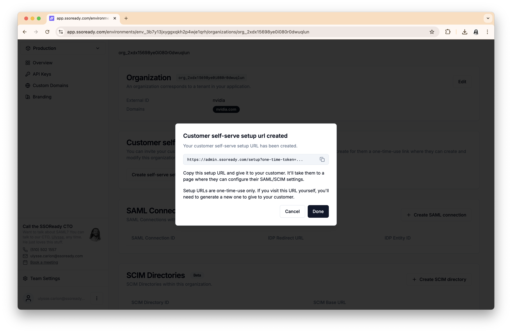
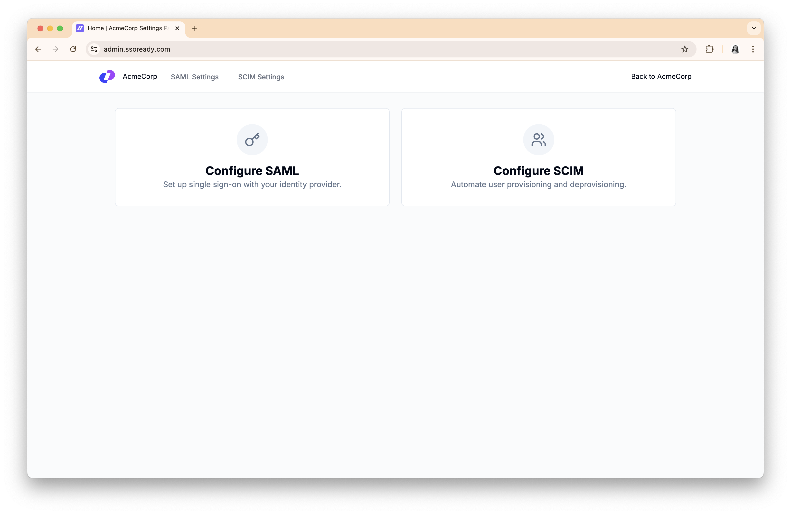
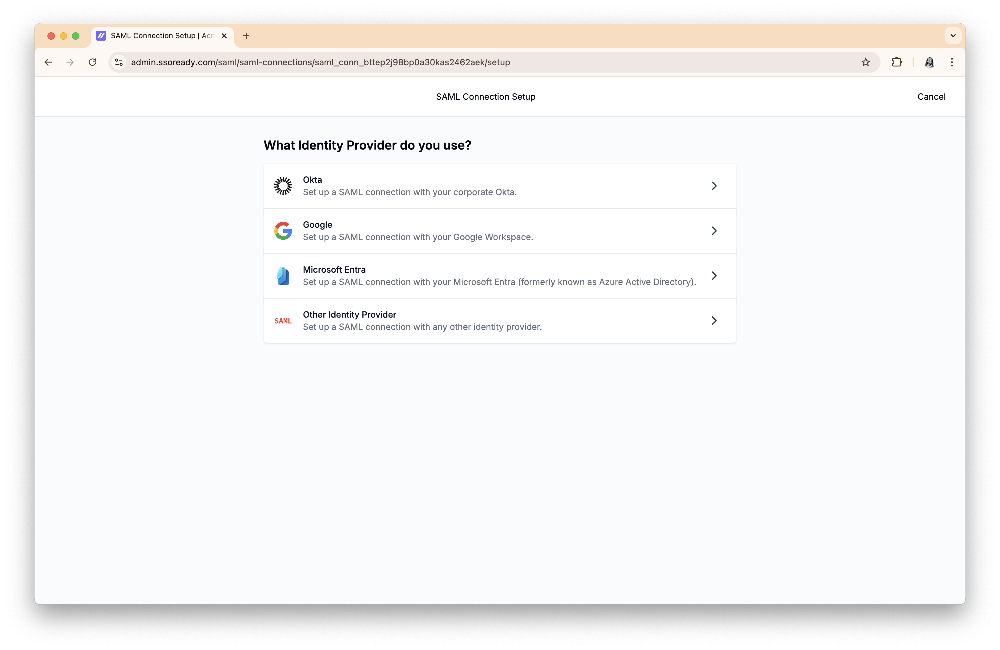
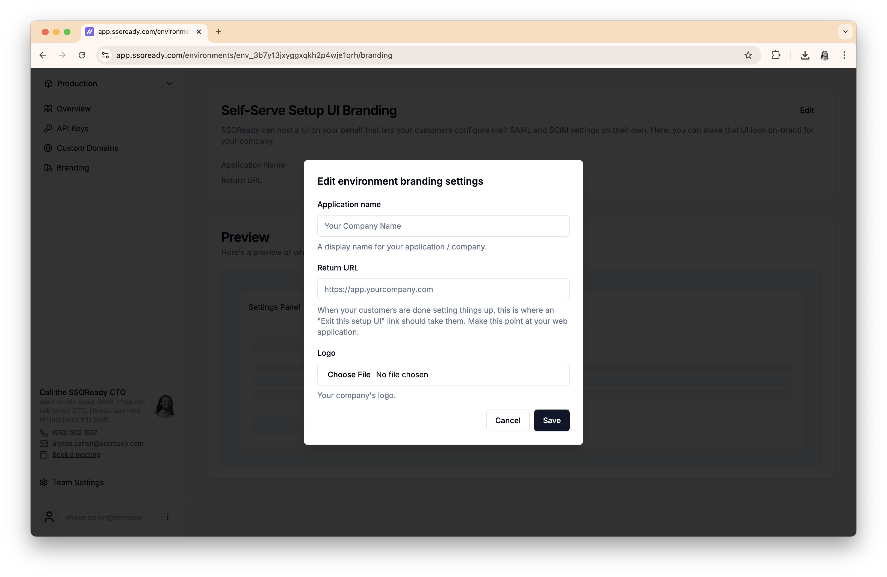
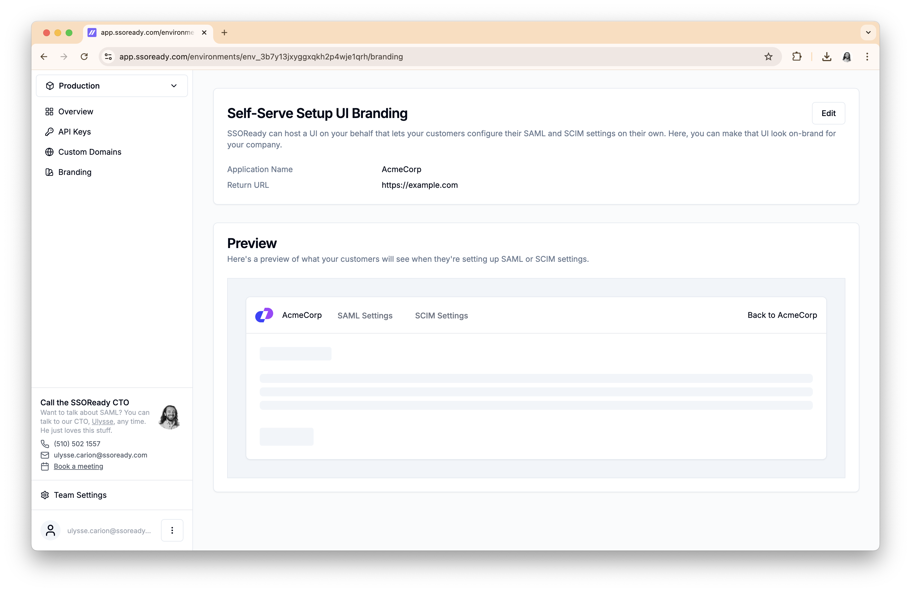

SSOReady can host on your behalf a self-serve UI that lets your customers enable
SAML and SCIM. SAML and SCIM both require ahead-of-time configuration to work,
and getting those settings to work is a tricky and vendor-specific process.

SSOReady lets you generate self-serve setup links which you give to your
customer. These are short-lived, one-time links that let your users manage the
[SAML connections](/docs/ssoready-concepts/saml-connections) and/or [SCIM
directories](/docs/ssoready-concepts/scim-directories) of their
[organization](/docs/ssoready-concepts/organizations). You can generate these
links [from the SSOReady
webapp](/docs/ssoready-concepts/organizations#customer-self-serve-setup) or
[programmatically](/docs/management-api).

# Motivation

Every time one of your enterprise customers wants to enable SAML or SCIM, both
you and your customer need to exchange a set of settings before attempting to
use the SAML or SCIM protocol. This is an inherent property of how SAML and SCIM
work.

For example, SAML requires that you give your customers two settings:

* A SAML [ACS ("Assertion Consumer Service") URL](/docs/ssoready-concepts/saml-connections#assertion-consumer-service-acs-url)
* A SAML [SP ("Service Provider") Entity ID](/docs/ssoready-concepts/saml-connections#sp-entity-id)

And then your customer needs to give you three settings:

* A SAML [IDP ("Identity Provider") Entity ID](/docs/ssoready-concepts/saml-connections#idp-entity-id)
* A SAML [Redirect URL](/docs/ssoready-concepts/saml-connections#redirect-url)
* A SAML [IDP Certificate](/docs/ssoready-concepts/saml-connections#certificate)

(SCIM is a bit simpler; you just need to give your customer a [SCIM Base
URL](/docs/ssoready-concepts/scim-directories#scim-base-url) and a [SCIM bearer
token](/docs/ssoready-concepts/scim-directories#scim-authentication). They don't
need to give you anything. But the challenge is that the bearer token is a
sensitive secret, and so you need to give them the bearer token over a secure
channel.)

In practice, exchanging these settings is a bit of a headache:

* Many customers' IT admins don't know how to use their Identity Provider to
  give you these settings, so you'll have to walk them through the process.
* Every Identity Provider vendor uses different terminology for these settings.
  The SAML ACS URL is called a "Reply URL" in Microsoft Entra, a "Single Sign-on URL"
  in Okta, and an "ACS URL" in Google.
* Identity Providers do the steps in a different order; Google gives your
  customer the IDP Entity ID, Redirect URL, and IDP Certificate first, and then
  asks for the ACS URL and SP Entity ID. Entra and Okta do it the order way
  around.
* The IDP Certificate in particular is difficult. It's an
  [X.509](https://en.wikipedia.org/wiki/X.509) certificate. There are many ways
  it can be formatted.

These issues are not insurmountable. Plenty of companies just deal with the
emails/meetings to get this sorted out, looping in engineers as required.
Usually, the long-term value of enterprise deals makes this worth it.

But with self-serve setup links, this issue goes away entirely. You'll be giving
your customer a best-in-class SAML/SCIM onboarding experience. Without any
engineering work at all.

# How it works

<Frame caption="Creating a self-serve setup link">
    
</Frame>

On any [organization](/docs/ssoready-concepts/organizations), you can create a
self-serve setup link. You choose whether your customer will be able to use the
link to configure SAML, SCIM, or both. You give that link to your customer.

<Check>
Self-serve setup links are one-time-use only, and are valid for 24 hours.
They're meant to be safe to give to your customer over email, Slack, Zoom
chat, or any other private channel you use to talk to your customer.
</Check>

When your customer visits the link, they'll be shown a UI where they can
configure SAML and/or SCIM (depending on what you decided when creating the
link).

<Frame caption="What your customer sees after visiting a self-serve setup link. See &quot;Custom Branding&quot; on how to customize the logo, company name, and &quot;back&quot; link.">
    
</Frame>

When setting up SAML, the first thing we'll ask your customer is which Identity
Provider they use. That lets us give your customer instructions specific to
their Identity Provider.

<Frame caption="Asking your customer what vendor they use lets us give them a setup experience tailored to exactly what they'll see in their Identity Provider.">
    
</Frame>

We break down the SAML setup process into quick steps, ordered based on what's
most natural for their Identity Provider. Every step has both written
instructions and animated videos showing them what they need to do, and they can
quickly copy-paste settings into their Identity Provider.

<Frame caption="An example of what your customer sees. This example is for configuring the ACS URL in Okta.">
    
</Frame>

# Custom Branding and Domains

To keep the setup experience intuitive and on-brand for your customer, you can
configure:

1. Your company's logo, which appears in the navigation bar
2. Your company's name, which appears anywhere the experience needs to refer to your product by name
3. A "return URL", which is where the "Back to \[your-company-name\]" link takes your customer

<Frame caption="Configuring your branding settings.">
    
</Frame>

You can preview what your branding settings look like within the app, without
having to send your customer a setup link.

<Frame caption="In-app preview of your branding settings.">
    
</Frame>

By default, the self-serve setup experience runs on `admin.ssoready.com`. You
can customize what domain that runs on by going to your environment's [custom
domain settings](/docs/ssoready-concepts/environments#running-adminssoreadycom-on-a-custom-domain).