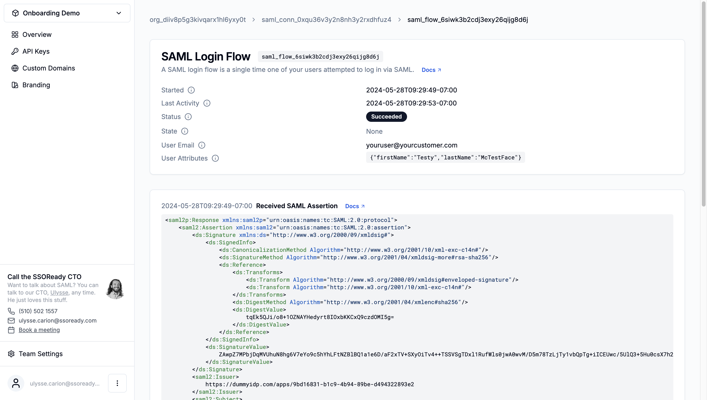

A SAML login flow is an audit log of a single time one of your users attempted
to log in via SAML. SAML login flows track the timestamp and details of every
step in the SAML protocol.

A SAML login flow belongs to exactly one [SAML
connection](/docs/ssoready-concepts/saml-connections).

# Properties

<Frame caption="A SAML login flow, as displayed in the SSOReady web app.">
    
</Frame>

## SAML Login Flow ID

Every SAML login flow has an ID starting with `saml_flow_...`, for example:

```
saml_flow_c2nrnid1sr9nexrqorczyxqpb
```

SAML login flow IDs are universally unique.

## Start Time

A SAML login flow's start time tracks when the login process began. For
SP-initiated flows, this tracks when your application [initiated a SAML
login](/docs/saml/saml-quickstart#initiating-saml-logins). For IDP-initiated
flows, this tracks when the identity provider redirected the user to the [SAML
connection's ACS
URL](/docs/ssoready-concepts/saml-connections#assertion-consumer-service-acs-url).

## Last Activity Time

A SAML login flow's last activity time tracks the last time any progress has
happened on the SAML login flow. It's equal to the timestamp of the latest event
in the SAML login flow's [event log](#event-log).

## Status

A SAML login flow can be in one of three states:

- **Succeeded** SAML login flows are ones where your application [handled the
  SAML login](/docs/saml/saml-quickstart#handling-saml-logins), by calling the
  [Redeem SAML Access Code](/docs/api-reference/saml/redeem-saml-access-code)
  endpoint.
- **Failed** SAML login flows are ones where the identity provider provided an
  invalid SAML assertion. Failed SAML login flows have [error
  details](#error-details).
- **In Progress** SAML login flows aren't succeeded or failed yet. The user may
  still be navigating their identity provider, and the SAML login flow may still
  yet succeed or fail.

## State

A SAML login flow's `state` is the `state` you provided to the ["Get SAML
Redirect URL"
endpoint](/docs/api-reference/saml/get-saml-redirect-url#request.body.state).

You can do anything you like with this state, but the most common use-case is to
keep track of where to redirect your user back to after logging in with SAML.

If your user logged in to your product using Identity Provider-initiated SAML
(e.g. they clicked on your app inside their corporate Okta dashboard), then this
state will be empty.

SSOReady validates the authenticity of non-empty state values. You do not need
to implement your own CSRF on top of it, but doing so anyway will have no bad
consequences.

Under the hood, SSOReady uses a [SAML
`RelayState`](<https://docs.oasis-open.org/security/saml/Post2.0/sstc-saml-tech-overview-2.0.html#:~:text=Sometimes%20a%20binding%2Dspecific%20field%20called%20RelayState%20is%20used%20to%20coordinate%20messages%20and%20actions%20of%20IdPs%20and%20SPs%2C%20for%20example%2C%20to%20allow%20an%20IdP%20(with%20which%20SSO%20was%20initiated)%20to%20indicate%20the%20URL%20of%20a%20desired%20resource%20when%20communicating%20with%20an%20SP.>)
to implement this functionality.

## User Email

Successful SAML login flows keep track of the end user's email address.

SSOReady always validates these email addresses against the appropriate
organization's [domains](/docs/ssoready-concepts/organizations#domains). If the
identity provider sends an email address outside the list of allowed domains,
the SAML login flow have an [email outside organization
domains](#email-outside-organization-domains) error.

## User Attributes

Successful SAML login flows keep track of arbitrary user attributes an identity
provider passed along about an end user.

These attributes are always a mapping of keys and values. User attribute keys
and values are both guaranteed to be strings.

## Error Details

When a SAML login flow fails, SSOReady will include details about the problems
with that SAML login flow.

### Unsigned Assertion

SSOReady requires that SAML assertions be cryptographically signed. Most
identity providers do so by default, but some can be configured to not do so.

To fix this, your customer must change their identity provider settings to sign
assertions.

### Bad Issuer

Every SAML assertion includes an "issuer". This needs to correspond to the SAML
connection's [IDP Entity
ID](/docs/ssoready-concepts/saml-connections#idp-entity-id). If the SAML
assertion's `<saml2:Issuer>` element isn't the same as the expected IDP entity
ID, then SSOReady will reject the SAML assertion.

To fix this, you need to update the SAML connection's IDP entity ID to be the
expected value. You can't ask your customer to change their identity provider's
entity ID; that's not a setting most identity providers allow users to
configure.

### Bad Audience

Every SAML assertion includes an "audience". This needs to correspond to the
SAML connection's [SP Entity
ID](/docs/ssoready-concepts/saml-connections#sp-entity-id). If the SAML
assertion's `<saml2:Audience>` element isn't the same as the expected SP entity
ID, then SSOReady will reject the SAML assertion.

To fix this, you need to have your customer update their identity provider
settings to provide the correct SP Entity ID.

### Email Outside Organization Domains

SSOReady applies an additional layer of security on top of the traditional SAML
security model: before accepting a SAML login, SSOReady verifies that the user's
email is within the parent organization's [whitelist of
domains](/docs/ssoready-concepts/organizations#domains).

SSOReady does this check for you to mitigate the fact that your customers can
put whatever emails they please into their identity provider. Without SSOReady's
domain check, a malicious customer (or one of their disgruntled IT admins) could
send you SAML assertions that contain the email addresses of a different
customer. A simple whitelist of domains that an organization is allowed to log
in as prevents this type of attack.

<Note>
For an in-depth explainer on this type of attack, see the SSOReady blog post
["Using SAML to add abraham.lincoln@whitehouse.gov to my Slack
workspace"](https://ssoready.com/blog/engineering/abraham-lincoln-and-the-malicious-saml-idp/).
</Note>

If your customer is sending you legitimate SAML assertions that fail because of
the domain whitelist, you can fix that by adding the legitimate email address's
domain to the domain whitelist.

## Event Log

Every SAML flow has an event log that will contain up to four elements:

### Requested SAML Redirect URL

Represents when you called the [Get SAML
Redirect URL endpoint](/docs/api-reference/saml/get-saml-redirect-url), and the
URL you got back from that call.

### Initiated SAML Flow

Represents when your end user visited the redirect URL, and the SAML
authentication request that SSOReady sent their identity provider.

### Received SAML Assertion

Represents when your user was redirected from their identity provider back to
SSOReady. Contains the SAML assertion SSOReady received from the identity
provider.

### Redeemed SAML Access Code

Represents when your application called the [Redeem SAML Access
Code](/docs/api-reference/saml/redeem-saml-access-code) endpoint. Contains the
data your application got back from that API call.
