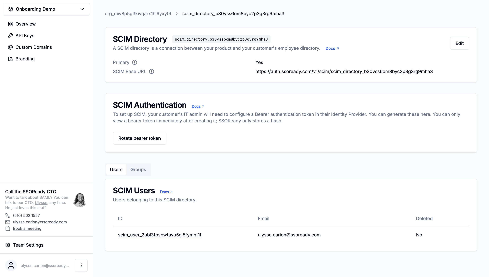

SCIM directories are how you implement
[SCIM](https://en.wikipedia.org/wiki/System_for_Cross-domain_Identity_Management)
using SSOReady. Every SCIM directory contains:

1. The settings your customer needs to set up a SCIM directory sync from their
identity provider into your product, and
2. A repository of users and groups. Your customer's identity provider securely
populates the users and groups using the SCIM protocol. Your application uses SSOReady's
SDKs or HTTP API to fetch those users and groups, and provision them inside your
product.

Every SCIM directory belongs to exactly one
[organization](/docs/ssoready-concepts/organizations). Organizations in turn
belong to exactly one [environment](/docs/ssoready-concepts/environments). You
can have any number of SCIM directories within an organization. Up to one SCIM
directory per organization can be [primary](#primary).

The SCIM protocol is designed such that your customer needs to put a SCIM
directory's [base URL](#scim-base-url) and [bearer token](#scim-authentication)
into their identity provider before syncing can begin. When you use SSOReady's
[self-service SCIM
configuration](/docs/idp-configuration/enabling-self-service-configuration-for-your-customers),
your customer can securely do this on their own, without any work on
your part.

# Properties

<Frame caption="A SCIM directory, as displayed in the SSOReady web app.">
    
</Frame>

## SCIM Directory ID

Every SCIM directory has an ID starting with `scim_directory_...`, for example:

```
scim_directory_aler4q1vev4x0uxoxxzk696ou
```

SCIM directory IDs are universally unique.

## Primary

Up to one SCIM directory within an
[organization](/docs/ssoready-concepts/organizations) can be marked as
"primary".

A primary SCIM directory works exactly like any other SCIM directory,
but with one special behavior for your convenience: when you [list SCIM
users](/docs/scim/scim-quickstart#listing-users) or
[groups](/docs/scim/scim-quickstart#listing-groups), you can provide an
[`organizationExternalId`](/docs/api-reference/scim/list-scim-users#request.query.organizationExternalId)
or
[`organizationId`](/docs/api-reference/scim/list-scim-users#request.query.organizationExternalId).
When you do so, the primary SCIM directory of that organization is SCIM
directory users or groups are listed from.

If none of the SCIM directories in an organization are marked as primary,
listing SCIM users or groups using `organizationExternalId` or `organizationId`
for that organization will return an error when from SSOReady's API.
The solution is to mark one of the SCIM directories as primary, or to pass a
[`scimDirectoryId`](/docs/api-reference/scim/list-scim-users#request.query.scimDirectoryId)
instead.

## SCIM Base URL

Every SCIM HTTP server has a base URL, from which the identity
provider can determine the SCIM HTTP requests it wants to send when provisioning
or deprovisioning users and groups.

SSOReady assigns each SCIM directory a base URL, which needs to be
inputted into the customer's identity provider. SCIM base URLs look something
like this:

```
https://auth.ssoready.com/v1/scim/scim_directory_...
```

If you use a custom domain for `auth.ssoready.com`, then the base URL will
instead look like:

```
https://auth.yourcompany.com/v1/scim/scim_directory_...
```

Where `auth.yourcompany.com` is your custom `auth.ssoready.com` domain.

## SCIM Authentication

When identity providers send requests to the SCIM server runs on your behalf,
they need to include an `Authorization` HTTP header with a `Bearer` token to
authenticate their requests.

SSOReady assigns the bearer token for a SCIM server for you They start with
`ssoready_scim_bearer_token_...`. For example:

```
ssoready_scim_bearer_token_9yk9nijlzz8oggcsxf69ujbdw
```

The SCIM directory bearer token needs to be inputted by your customer into their
identity provider. If you use SSOReady's [self-service SCIM
configuration](/docs/idp-configuration/enabling-self-service-configuration-for-your-customers),
your customer can configure SAML without any work on your part.

For security, SSOReady only stores a hash of the bearer token. The only way to
access a SCIM directory's bearer token is to generate a new one by [rotating the
bearer token](#rotating-bearer-tokens).

### Rotating bearer tokens

If your customer ever loses their SCIM directory bearer token, or
accidentally leaks it, you can deactivate the old bearer token and generate a
new one by rotating the SCIM directory's bearer token.

Rotating a SCIM directory's bearer token will break any outstanding SCIM
connections with that directory. Existing connections will fail to authenticate
until they are updated with the new bearer token. This won't cause data loss. It
will, however, mean that new users won't be provisioned or deprovisioned in your
application until the customer's identity provider settings are updated.

## Users

SCIM directories contain a list of [SCIM
users](/docs/ssoready-concepts/scim-users) that belong to the directory.

The list of users here is meant to see that the SCIM sync is working, and as a
debugging aid. From your application, you can programmatically list the SCIM
users in a SCIM directory using the [List SCIM
Users](/docs/api-reference/scim/list-scim-users) API endpoint.

## Groups

SCIM directories contain a list of [SCIM
groups](/docs/ssoready-concepts/scim-groups) that belong to the directory.

The list of groups here is meant to see that the SCIM sync is working, and as a
debugging aid. From your application, you can programmatically list the SCIM
groups in a SCIM directory using the [List SCIM
Groups](/docs/api-reference/scim/list-scim-groups) API endpoint.
