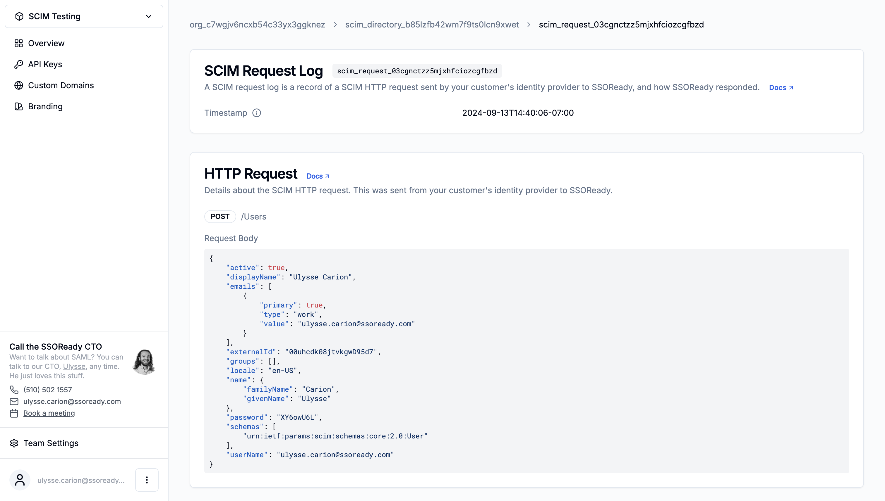
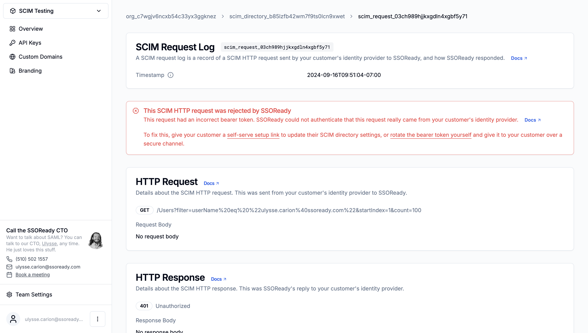
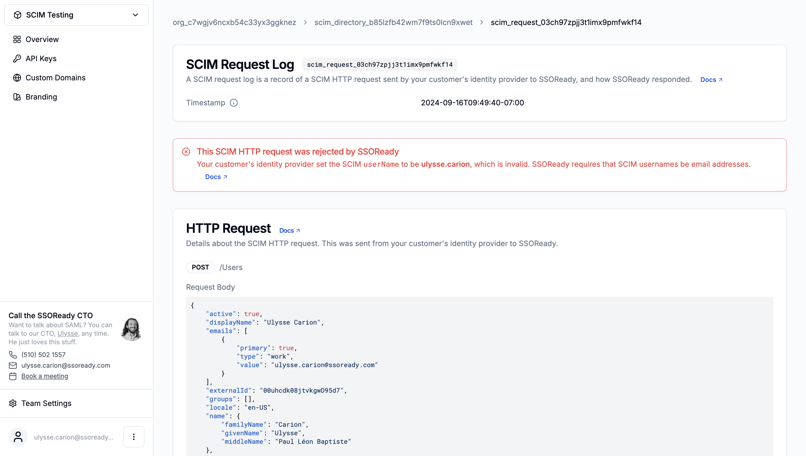
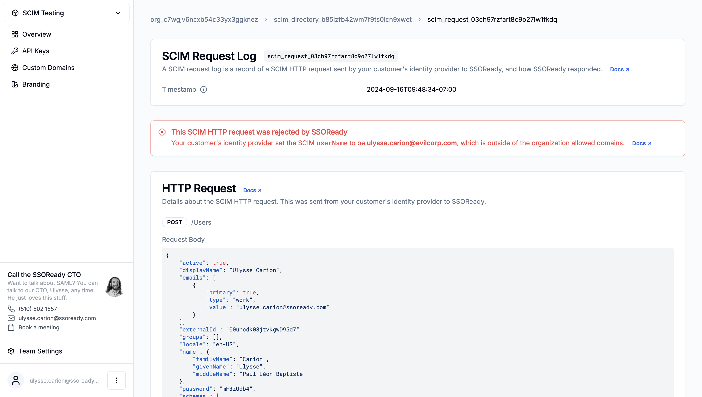

A SCIM request log is an audit log of a single time your customer's identity
provider sent SSOReady a SCIM HTTP request. SCIM request logs track the
timestamp and payload of every HTTP request in the SCIM protocol.

A SCIM request log belongs to exactly one [SCIM directory](/docs/ssoready-concepts/scim-directories).

# Properties

<Frame caption="A SCIM request log, as displayed in the SSOReady web app.">
    
</Frame>

## SCIM Request Log ID

Every SCIM request log has an ID starting with `scim_request_...`, for example:

```
scim_request_03cgnctzz5mjxhfciozcgfbzd
```

SCIM request IDs are universally unique.

## Timestamp

A SCIM request log's timestamp tracks when your customer's identity provider
sent SSOReady an HTTP request.

## Error Details

When a SCIM request from your customer's identity provider fails, SSOReady will
include details about that failure on the SCIM request log.

### Bad Bearer Token

<Frame caption="A SCIM request log with an invalid SCIM bearer token.">
    
</Frame>

Every SCIM directory has a secret [bearer
token](//docs/ssoready-concepts/scim-directories#scim-authentication) associated
with it. This bearer token lets SSOReady authenticate that a SCIM HTTP request
is really coming from your customer's identity provider.

If a SCIM HTTP request has the wrong bearer token (or no bearer token at all),
then SSOReady will reject the HTTP request.

To fix this, you must have your customer update the bearer token they have
configured in their identity provider. You can do so in one of two ways:

1. Give your customer a [self-serve setup
link](/docs/idp-configuration/enabling-self-service-configuration-for-your-customers)
to reconfigure their SCIM directory settings. From that link, your customer will
rotate the SCIM directory's bearer token and update their identity provider
settings.
2. [Rotate the bearer
token
yourself](/docs/ssoready-concepts/scim-directories#rotating-bearer-tokens), and
give your customer the new bearer token over a secure channel.

### Bad `userName`

<Frame caption="A SCIM request log with an invalid SCIM userName.">
    
</Frame>


The SCIM specification has the concept of a
[`userName`](https://datatracker.ietf.org/doc/html/rfc7643#section-4.1.1) on a
user. SSOReady requires that this `userName` be formatted as an email.

Most identity providers default to having `userName` be an email by default, but
your customer can configure it to have some other format instead.

To fix this error, your customer needs to configure their identity provider to
send `userName` formatted as an email address.

### Email Outside Organization Domains

<Frame caption="A SCIM request log with an email outside the organization's whitelist of domains.">
    
</Frame>

SSOReady applies an additional layer of security on top of the traditional SCIM
security model: before accepting a SCIM user, SSOReady verifies that the user's
email is within the parent organization's [whitelist of
domains](/docs/ssoready-concepts/organizations#domains).

SSOReady does this check for you to mitigate the fact that your customers can
put whatever emails they please into their identity provider. Without SSOReady's
domain check, a malicious customer (or one of their disgruntled IT admins) could
send you SCIM HTTP requests that contain the email addresses of a different
customer. A simple whitelist of domains that an organization is allowed to log
in as prevents this type of attack.

<Note>
    For an in-depth explainer on this type of attack, see the SSOReady blog post
    ["Using SAML to add abraham.lincoln@whitehouse.gov to my Slack
    workspace"](https://ssoready.com/blog/engineering/abraham-lincoln-and-the-malicious-saml-idp/).
    That blog post is primarily concerned with SAML, but similar attacks are
    possible with SCIM as well.
</Note>

If your customer is sending you legitimate SCIM HTTP requests that fail because
of the domain whitelist, you can fix that by adding the legitimate email
address's domain to the domain whitelist.

## HTTP Request Details

Every SCIM request log tracks the following details about your customer's
identity provider's HTTP request to SSOReady:

* The HTTP method (GET, POST, etc.)
* The HTTP request path (e.g. "/Users")
* The HTTP request body, if any

The contents of these requests vary slightly by identity provider, but are
generally specified by the [SCIM HTTP
Protocol](https://datatracker.ietf.org/doc/html/rfc7644).

SCIM request logs do not track HTTP request headers, because they contain
sensitive information (e.g. an `Authorization` header).

## HTTP Response Details

Every SCIM request log tracks the following details about SSOReady's response to
your customer's identity provider:

* The HTTP status code (200 OK, 404 Not Found, etc.)
* The HTTP response body, if any
