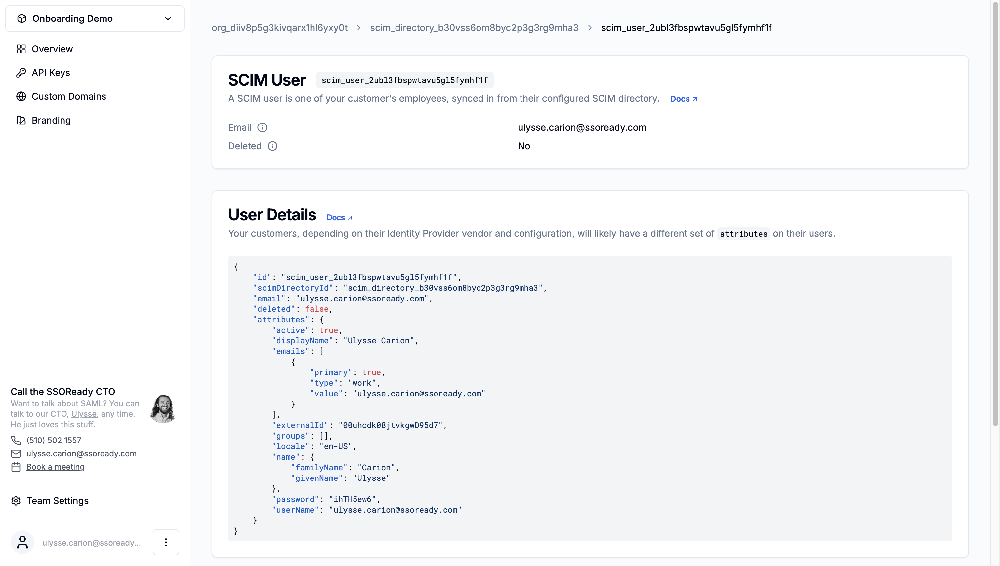

A SCIM user is a user your customer's identity provider provisioned in a [SCIM
directory](/docs/ssoready-concepts/scim-directories). For guidance on how you
should sync SCIM users into your application, see ["Syncing
Users"](/docs/scim/scim-quickstart#syncing-users) in the SCIM
quickstart guide.

This document details how a SCIM user appears in the SSOReady web application
that you as a developer use. This UI is meant to see that the SCIM sync is
working, and as a debugging aid. From your application, you can programmatically
get a SCIM user by ID using the [Get SCIM
User](/docs/api-reference/scim/get-scim-user) API endpoint.

# Properties

<Frame caption="A SCIM user, as displayed in the SSOReady web app.">
    
</Frame>

## SCIM User ID

Every SCIM user has an ID starting with `scim_user_...`, for example:

```
scim_user_eayqn84gu63k99rg5gcffesms
```

SCIM user IDs are universally unique.

## Email

Every SCIM user has an `email`.

SSOReady always validates these email addresses against the appropriate
organization's [domains](/docs/ssoready-concepts/organizations#domains). If the
identity provider sends an email address outside the list of allowed domains,
SSOReady will refuse to create a SCIM user with that email address.

## Deleted

When a SCIM provider deprovisions or deletes a SCIM user, they are not deleted
from SSOReady entirely. Instead, they are marked with `deleted` set to `true`.

Deleted users appear in the list of SCIM users just like any other SCIM users
do. It is your responsibility to decide how to handle a `deleted` user.
SSOReady's recommendations on this are discussed in ["Deprovisioning (deleting
or soft-deleting)
users"](/docs/scim/scim-quickstart#deprovisioning-deleting-or-soft-deleting-users)
in the SCIM quickstart guide.

The SCIM protocol specifies two ways in which a user may be deprovisioned. The
identity provider may "hard-delete" the SCIM user by [sending a `DELETE`
request](https://datatracker.ietf.org/doc/html/rfc7644#section-3.6). Or it may "soft-delete" the SCIM user by
[modifying via `PATCH` or `PUT`](https://datatracker.ietf.org/doc/html/rfc7644#section-3.5) the
user's
[`active` SCIM
attribute](https://datatracker.ietf.org/doc/html/rfc7643#section-4.1.1).
Different identity providers default to using different approaches. SSOReady
treats all of these as equivalent; in all cases, a hard- or soft-deleted user
will simply have a `deleted` attribute set to `true`.

## Attributes

Identity providers may include arbitrary attributes on SCIM users, and SSOReady
will store these as the `attributes` on the user.

No two identity providers include the same set of `attributes`. Many customers
will configure their identity provider differently, and have different SCIM user
attributes. Don't expect consistency when relying on SCIM user attributes, but
they are all there if you need them.

<Note>
Though SCIM user `attributes` may be inconsistent, you can always rely on a SCIM
user `email` being present.
</Note>

## Groups

SCIM natively has the concept of [SCIM
groups](/docs/ssoready-concepts/scim-groups). SCIM groups contain SCIM users.
From the SSOReady app, you can view the list of groups containing the user.
